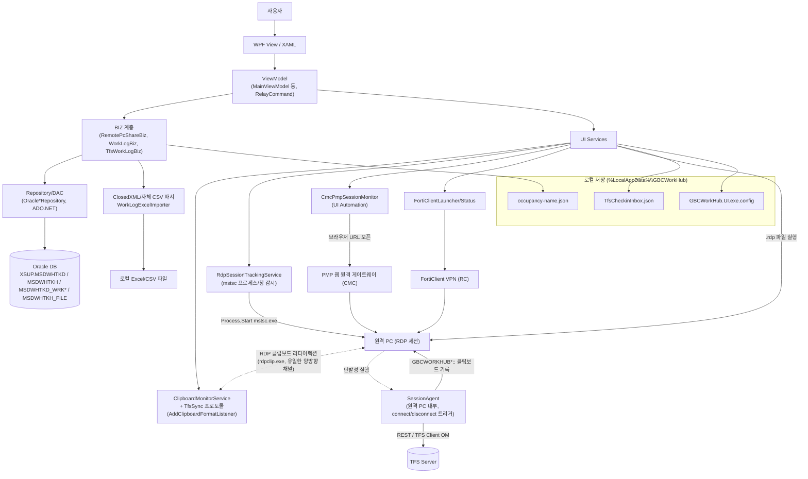
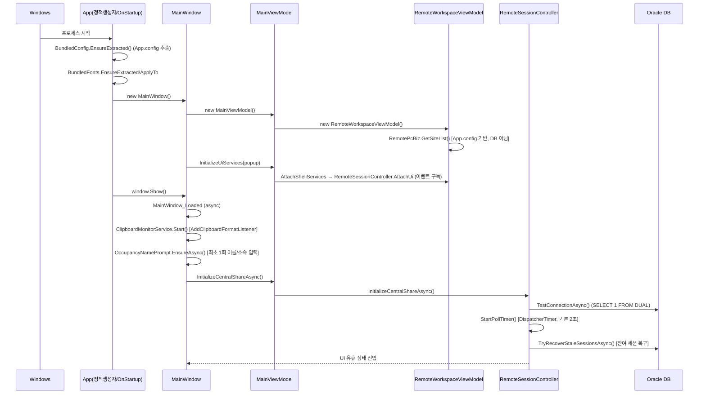
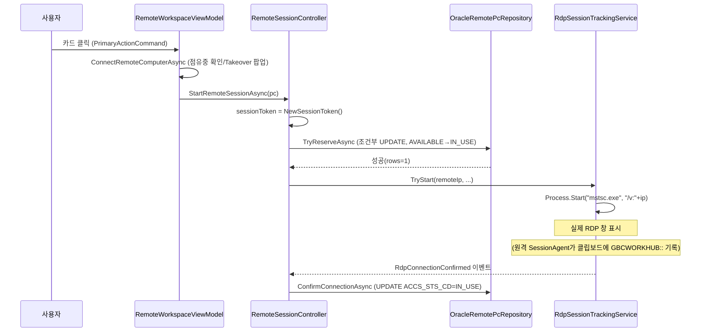
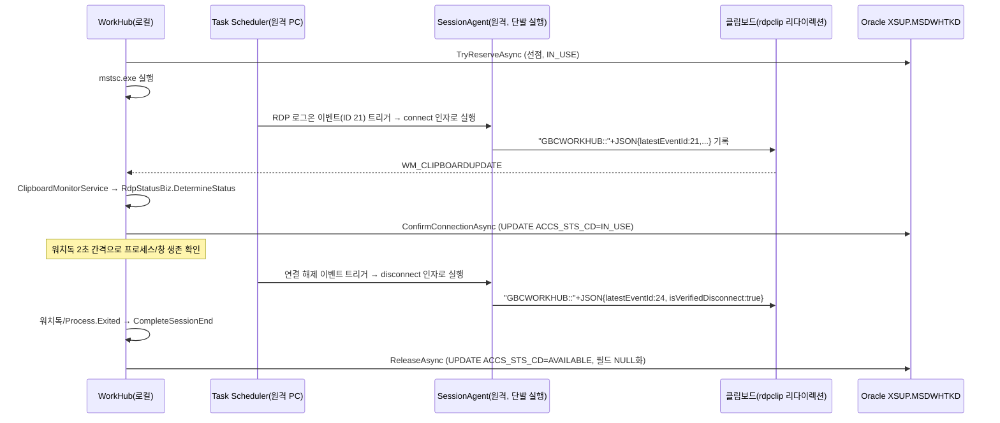
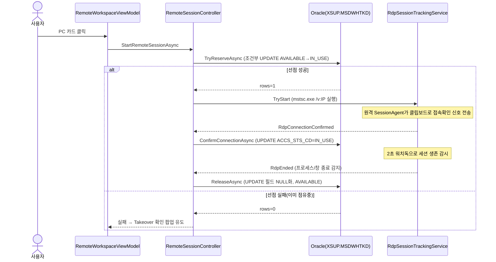
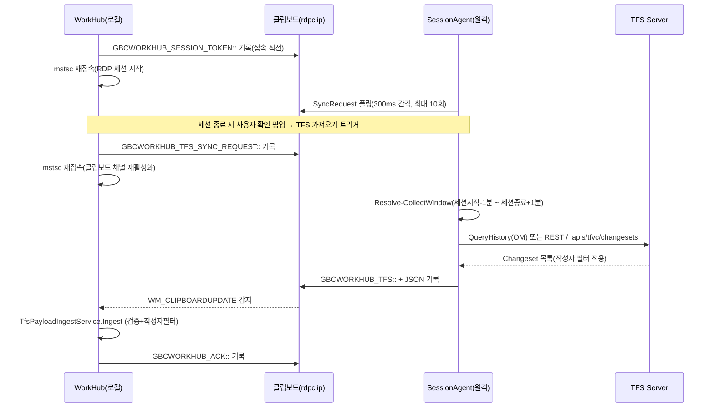
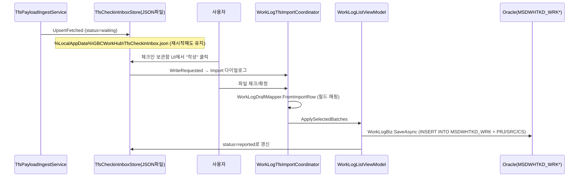
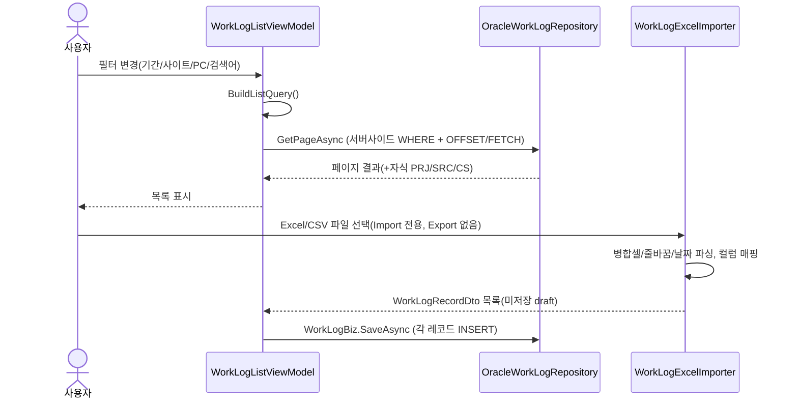

# GBCWorkHub Architecture & Implementation 조사 보고서

> 조사 원칙: 코드 미수정(read-only), 추측 금지, 실제 코드에 존재하는 구현만 기술, 문서/주석은 힌트로만 사용하고 실제 호출 흐름으로 검증.
> 신뢰도 표기: **[확인된 구현]** **[부분 구현]** **[미구현]** **[추정 불가]**
> 경로는 리포지토리 루트(`C:\Users\ezcare\OneDrive - ezcaretech\바탕 화면\GBCWorkHub`) 기준 상대경로.

---

# 1. 프로젝트 전체 구조

## 1-1. Solution / Project 구성

`GBCWorkHub.sln`에 등록된 프로젝트 8개, 그리고 `.sln`에 **등록되지 않은** 독립 도구 2개가 존재한다.

| 프로젝트 | 경로 | .sln 포함 | OutputType | TargetFramework |
|---|---|---|---|---|
| GBCWorkHub.DTO | `src/GBCWorkHub.DTO` | ✅ | Library | .NET Framework 4.8 |
| GBCWorkHub.DAC | `src/GBCWorkHub.DAC` | ✅ | Library | 4.8 |
| GBCWorkHub.BIZ | `src/GBCWorkHub.BIZ` | ✅ | Library | 4.8 |
| GBCWorkHub.UI | `src/GBCWorkHub.UI` | ✅ | **WinExe** (실제 실행파일) | 4.8 |
| GBCWorkHub.BIZ.Tests | `src/GBCWorkHub.BIZ.Tests` | ✅ | Exe(수제 테스트 러너, 프레임워크 없음) | 4.8 |
| GBCWorkHub.UI.Tests | `src/GBCWorkHub.UI.Tests` | ✅ | Exe(수제 테스트 러너) | 4.8 |
| GBCWorkHub.CsvImportTool | `src/GBCWorkHub.CsvImportTool` | ✅ | Exe(콘솔) | 4.8 |
| GBCWorkHub.SessionAgent | `tools/GBCWorkHub.SessionAgent` | ✅ | WinExe(원격 PC 배포용) | 4.8 |
| GBCWorkHub.SessionAgent(개선판) | `tools/agent-updates/GBCWorkHub.SessionAgent` | **❌ 미포함(독립 사본)** | WinExe | 4.8 |
| ImportWorkLogExcel | `tools/ImportWorkLogExcel` | **❌ 미포함(독립 사본)** | Exe(콘솔) | 4.8 |

**[확인된 구현]** `tools/agent-updates/GBCWorkHub.SessionAgent`는 `tools/GBCWorkHub.SessionAgent`와 `ProjectGuid`가 다르고 `ClipboardDeliveryState.cs`가 추가된 **더 견고화된 별도 버전**이며(§9 클립보드 절 참조), `tools/ImportWorkLogExcel`도 완전히 독립된 콘솔 도구다. C# 언어 버전은 어느 csproj에도 `<LangVersion>` 명시가 없어 툴체인 기본값 사용 **[추정 불가]**.

## 1-2. 각 프로젝트의 역할

- **GBCWorkHub.DTO**: 순수 데이터 모델(`RemotePcDto`, `WorkLogRecordDto`, `RdpStatusPayload` 등). Newtonsoft.Json만 참조.
- **GBCWorkHub.DAC**: Oracle 데이터 접근 — `IRemotePcRepository`/`OracleRemotePcRepository`, `IWorkLogRepository`/`OracleWorkLogRepository`, `ITfsWorkLogRepository`/`OracleTfsWorkLogRepository`, `OracleDevSessionFileRepository`, 그리고 **DB가 아니라 App.config 파일을 읽는** `RemotePcDac.cs`(§7 참조), 공용 파일 로거 `WorkHubFileLogger.cs`.
- **GBCWorkHub.BIZ**: 업무 로직 — `RemotePcBiz`/`RemotePcShareBiz`(점유), `RdpStatusBiz`(클립보드 상태 파싱), `TfsWorkLogBiz`/`TfsClipboardPayloadService`(TFS), `OccupancyNameStore`/`LocalNetworkHelper`(로컬 식별), `WorkLog/`(WorkLogBiz, Excel 임포터, TFS 파서/분류기), `DevSession/`(개발세션 파일추적, deprecated 프로토타입 포함).
- **GBCWorkHub.UI**: WPF 클라이언트 셸(`OutputType=WinExe`), Costura.Fody로 단일 exe 패키징.
- **GBCWorkHub.CsvImportTool** / **tools/ImportWorkLogExcel**: 각각 독립 콘솔 배치 도구. BIZ/DAC/DTO를 재사용(§17 참조), UI 없이 Excel/CSV → DB 이관용.
- **tools/GBCWorkHub.SessionAgent**(+ 사이트별 변형): **원격 PC에서 실행되는 완전히 별도의 프로그램**. RDP 접속/해제 이벤트를 캡처해 클립보드로 로컬 WorkHub와 통신(§9, §12, §14 참조).

## 1-3. 주요 디렉터리 구조 (`src/GBCWorkHub.UI`)

```
GBCWorkHub.UI
 ├─ Views/                     — MainTabBar, MyPageView, RemoteWorkspaceView
 │   ├─ WorkLog/                — WorkLogListView(컨테이너)+Classic/Glass(2테마), WorkLogEditDialog,
 │   │                            TfsImportDialog, TfsCheckinInboxView, TfsImportHostWindow
 │   └─ Popup/                  — PopupHostWindow(실사용) / Confirm·Progress·ResultPopupView(★미사용 스텁)
 ├─ ViewModels/                 — MainViewModel(루트), RemoteWorkspaceViewModel(1815줄, 최대),
 │   │                            MyPageViewModel, TfsWorkLogViewModel, RelayCommand(MVVM 커맨드)
 │   ├─ WorkLog/                 — WorkLogListViewModel, EditDialogViewModel, TfsCheckinInboxViewModel,
 │   │                             DbMapper/DraftMapper(모델 변환), PersistenceService, TfsImportCoordinator
 │   └─ Popup/                   — PopupHostViewModel / ConfirmProgressResultViewModels(★미사용)
 ├─ Services/                   — 외부 연동 인프라(§1-4 표 참조)
 │   ├─ Popup/                   — PopupService(단일 구현체)
 │   └─ TfsSync/                 — TfsSyncCoordinator, TfsPayloadIngestService, TfsClipboardAckService,
 │                                 TfsCheckinInboxStore, ClipboardProtocolLease(Manager), IClipboardAccessor
 ├─ Controls/                   — CustomDropdown, InlineOptionPicker, InlineSuggestionField, WheelPicker
 ├─ Models/                     — LastProcessedRdpState, RdpLaunchPurpose, Popup/(요청·결과 DTO)
 └─ Assets/                     — XAML 리소스(ThemeConfig=디자인 토큰, WorkLogStyles/GlassStyles=2테마), SVG, Pretendard 폰트
```

**[미구현]** `Views/Popup/ConfirmPopupView.xaml`/`ProgressPopupView.xaml`/`ResultPopupView.xaml`과 대응 VM 3종은 스텁 상태(`<TextBlock Text="ConfirmPopupView" />` 한 줄)로 남아있고, 실제로는 `PopupHostWindow` 하나가 Confirm/Prompt/Progress/Result를 조건부 바인딩으로 전부 처리한다. 리팩터링이 계획되었다가 중단된 흔적.

## 1-4. 프로그램 Entry Point

**[확인된 구현]** `App.xaml`에서 `StartupUri`가 의도적으로 제거되어 있다(주석: "OnStartup creates MainWindow with try/catch for XamlParse diagnostics"). 실제 진입점은 `App.xaml.cs`의 `OnStartup` 오버라이드다.

```csharp
protected override void OnStartup(StartupEventArgs e) {
    base.OnStartup(e);
    DispatcherUnhandledException += App_DispatcherUnhandledException;
    AppDomain.CurrentDomain.UnhandledException += CurrentDomain_UnhandledException;
    BundledFonts.ApplyTo(this);
    try { var window = new MainWindow(); MainWindow = window; window.Show(); }
    catch (Exception ex) { ... Shutdown(-1); }
}
```
(`App.xaml.cs:19-38`) 그 이전에 `App`의 정적 생성자가 `BundledConfig.EnsureExtracted()`/`BundledFonts.EnsureExtracted()`를 호출한다(`:13-17`).

## 1-5. 앱 시작 시 최초 실행 흐름 (정확한 호출 순서)

1. **`App` 정적 생성자** — `BundledConfig.EnsureExtracted()`: exe에 임베딩된 App.config를 `%LocalAppData%\GBCWorkHub\GBCWorkHub.UI.exe.config`로 추출하고 `ConfigurationManager` 내부 static 필드를 리플렉션으로 리셋(`BundledConfig.cs:36-61`). `BundledFonts.EnsureExtracted()`: Pretendard 4종 otf 추출.
2. **`App.OnStartup`**: 전역 예외 핸들러 2종 등록 → `BundledFonts.ApplyTo(this)`(폰트 리소스 주입).
3. **`new MainWindow()`**: 필드 이니셜라이저에서 이미 `new MainViewModel()` 생성 완료.
   - **`MainViewModel` 생성자**: `TfsWorkLogViewModel`/`WorkLogListViewModel` 생성 → `new RemoteWorkspaceViewModel(callback)` 생성
     - **`RemoteWorkspaceViewModel` 생성자**: `RemotePcBiz`/`RemoteSessionController` 생성 → `_remotePcBiz.GetSiteList()` 호출(**App.config 기반**, DB 아님) → `WorkHubUserAccount`/`WorkHubClientPc`/`LocalAccessIp` 채움 → `ApplyWorkHubUserToSession()`
   - `new MyPageViewModel(...)`, `RelayCommand` 4종 생성
   - `DataContext = _viewModel`(`MainWindow.xaml.cs:26`)
   - `_viewModel.InitializeUiServices(_popupService)` 호출 →
     - `new TfsSyncCoordinator(popup, RdpTracker, TfsWorkLog, ...)` 생성
     - `RemoteWorkspaceViewModel.AttachShellServices` → `RemoteSessionController.AttachUi` → `RdpSessionTrackingService`/`CmcPmpSessionMonitor` 이벤트 구독(RdpStarted/RdpConnectionConfirmed/RdpEnded 등)
   - `Loaded += MainWindow_Loaded` 등록
4. **`window.Show()`** → `Loaded` 이벤트 발생
5. **`MainWindow_Loaded` (async void)**:
   1. `ClipboardMonitorService` 생성·이벤트 구독 → `.Start()` → `AddClipboardFormatListener(hwnd)` 등록(Win32, `WM_CLIPBOARDUPDATE` 수신 준비)
   2. `await OccupancyNamePrompt.EnsureAsync(popup)` — 점유명/소속이 없으면 입력 팝업 강제 표시(§6 참조)
   3. `RefreshLocalIdentity()` / `NotifyIdentityChanged()` — 식별 정보 재조회 및 헤더 갱신
   4. `await UiPopupPreview.RunOnceAsync(...)` — **[확인된 구현이나 데모 목적]** 최초 1회 하드코딩된 더미 데이터로 팝업 시퀀스를 보여주는 온보딩 연출(`%LocalAppData%\GBCWorkHub\ui-preview-takeover-checkin.done` 플래그 파일로 1회만 실행). 실데이터 흐름이 아니므로 발표 시 혼동 주의.
   5. `await InitializeCentralShareAsync()` → **`RemoteSessionController.InitializeCentralShareAsync`**:
      - `_share.IsConfigured` false면 "DB 미설정" 상태로 `StartPollTimer()`만 실행 후 반환
      - true면 `TestConnectionAsync()`로 Oracle 실제 연결 시도 → 상태 텍스트 갱신
      - `StartPollTimer()`(폴링 타이머 시작, 기본 2초 간격, App.config `RemotePc.DbPollSeconds`)
      - 성공 시 `TryRecoverStaleSessionsAsync()`, `TryAdoptLiveCmcSessionsAsync()` 순차 실행 — 이전 세션 잔여 상태 복구

이후 UI는 유휴 상태로 진입, 사용자 조작과 클립보드 이벤트/폴링 타이머 콜백에 의해 구동된다.

**종료 시**: `Window_Closed` → `HandleAppClosingAsync()` → 이벤트 구독 해제 → `_clipboardMonitor.Dispose()` → `_viewModel.Dispose()` (상세는 §23).

## 1-6. 주요 화면과 View/ViewModel 연결 관계

바인딩은 일관되게 **"부모가 자식 View의 `DataContext`를 XAML에서 `{Binding <자식VM프로퍼티>}`로 명시 설정"** 방식이다.

| View | DataContext 소스 |
|---|---|
| MainWindow(자체) | 코드비하인드 `DataContext = _viewModel`(MainViewModel) |
| MainTabBar | 명시 설정 없음 → MainWindow의 MainViewModel 상속 |
| RemoteWorkspaceView | `{Binding RemoteWorkspace}` |
| MyPageView | `{Binding MyPage}` |
| WorkLog/WorkLogListView | `{Binding WorkLogList}` |
| WorkLogListClassicView/GlassView | 부모(WorkLogListView)의 DataContext 상속 |
| WorkLog/WorkLogEditDialog | `{Binding EditDialog}` |
| WorkLog/TfsImportDialog | `{Binding ImportDialog}` |
| Popup/PopupHostWindow | 코드에서 `DataContext = _vm`(PopupHostViewModel) 직접 주입 |

**[확인된 구현]** 팝업은 별도 OS 윈도우(`ShowDialog`)가 아니라 `MainWindow`의 오버레이 패널(`PopupOverlayHost` Grid)에 `PopupHostWindow`를 동적으로 `Children.Add`하는 **같은 윈도우 내 오버레이 UserControl** 방식이다.

## 1-7. 공통 Service/Repository/Model 구조

**[확인된 구현]** **DI 컨테이너 없음.** 전 계층이 "파라미터 없는 생성자가 기본 구현을 `new`로 박아넣고, 테스트용 오버로드로 인터페이스를 받는" 수동 생성자 체이닝 패턴이다.

- 인터페이스 + 체이닝: `RemotePcShareBiz() : this(new OracleRemotePcRepository())`, `TfsWorkLogBiz() : this(new OracleTfsWorkLogRepository())`, `WorkLogBiz() : this(new OracleWorkLogRepository())`
- 인터페이스 없이 직접 `new`: `RemotePcBiz`(`new RemotePcDac()`), `DevSessionFileBiz`(`new OracleDevSessionFileRepository()`, 인터페이스 자체가 없음)
- ViewModel도 동일 패턴: `RemoteWorkspaceViewModel`이 `RemotePcBiz`/`RemoteSessionController`를 필드에서 직접 `new`, `RemoteSessionController` 내부도 `RdpStatusBiz`/`RemotePcBiz`/`RemotePcShareBiz`/`RdpSessionTrackingService`/`CmcPmpSessionMonitor`/`DevSessionFileBiz`를 전부 직접 `new`.

Unity/Autofac/`Microsoft.Extensions.DependencyInjection` 등 실제 DI 컨테이너 참조는 어느 csproj에도 없다. 로깅도 계층마다 중복 구현(`GBCWorkHub.DAC.WorkHubFileLogger` vs `GBCWorkHub.UI.Services.DiagnosticLogger`, 둘 다 독립적으로 같은 파일에 기록).

## 1-8. 외부 시스템 연동 모듈

| 외부 시스템 | 담당 클래스 |
|---|---|
| Oracle DB(`GbcWorkHubDb`, XSUP 스키마) | `OracleRemotePcRepository`, `OracleWorkLogRepository`, `OracleTfsWorkLogRepository`, `OracleDevSessionFileRepository` |
| RDP(mstsc)/게시 RDP | `RemoteSessionController`, `PublishedRdpLauncher`, `RdpSessionTrackingService` |
| PMP(웹 원격, CMC) | `CmcPmpBrowserLauncher`, `CmcPmpSessionMonitor` |
| FortiClient VPN(RC) | `FortiClientLauncher`, `FortiVpnStatus` |
| TFS(형상관리) | UI측 `TfsWorkLogViewModel`/`TfsSyncCoordinator`/`OracleTfsWorkLogRepository`; 원격측 `tools/GBCWorkHub.SessionAgent`의 `TfsRecentCollector`/`Aurora_SessionAgent.ps1` |
| 클립보드 프로토콜(RDP 경계 통신) | `ClipboardMonitorService`, `TfsSync/ClipboardProtocolLeaseManager`, SessionAgent `ClipboardHelper` |

---

# 2. 사용 기술 Stack (전 csproj/packages.config/FodyWeavers.xml 확인)

| 기술명 | 어디서 사용 | 사용 목적 | 근거 |
|---|---|---|---|
| .NET Framework 4.8 | 전 프로젝트 | 런타임 타깃 | 각 csproj `TargetFrameworkVersion` |
| WPF | GBCWorkHub.UI | 데스크톱 UI 프레임워크 | `GBCWorkHub.UI.csproj:51-58` |
| MVVM(수동 구현) | UI 전체 | View/ViewModel 분리, `RelayCommand`/`INotifyPropertyChanged` | `ViewModels/RelayCommand.cs`, `ViewModelBase.cs` |
| Oracle.ManagedDataAccess 19.21.0/21.15.0 | UI(App.config용), DAC, CsvImportTool | Oracle DB(`GbcWorkHubDb`) 접속, 순수관리형(ODP.NET Managed) | `OracleRemotePcRepository.cs`, `OracleWorkLogRepository.cs` 등에서 `new OracleConnection` |
| Newtonsoft.Json 13.0.3 | UI, DTO, SessionAgent | 클립보드 JSON 페이로드 직렬화 — **System.Text.Json은 전혀 미사용(0건)** | `RdpStatusPayload` 등 |
| ClosedXML 0.104.2 + DocumentFormat.OpenXml 3.1.1 | BIZ | Excel(.xlsx) 업무기록 가져오기 | `WorkLogExcelXlsxImporter.cs` |
| CSV 파서 | BIZ | 자체 구현 RFC4180 스타일 파서(외부 라이브러리 없음) | `WorkLogExcelCsvImporter.ParseCsv` |
| Costura.Fody 4.1.0 + Fody 4.2.1 | UI | 참조 DLL을 IL 위빙으로 exe에 병합 → **단일 실행파일 배포** | `FodyWeavers.xml`(`<Weavers><Costura /></Weavers>`, 커스터마이징 없음) |
| System.Management(WMI) | UI | 프로세스 커맨드라인 조회(`RdpSessionTrackingService`) | `using System.Management;` |
| System.Windows.Automation(UIA) | UI | `CmcPmpSessionMonitor`가 브라우저 창의 UI Automation 이벤트로 PMP 세션 감시 | `CmcPmpSessionMonitor.cs` |
| System.Windows.Forms / System.Net.Http | tools/SessionAgent | 클립보드 접근, TFVC REST HTTP 호출 | `GBCWorkHub.SessionAgent.csproj` |
| Microsoft.Identity.Client | — | **[미구현]** 어느 csproj에도 참조 없음 — Azure AD/MSAL 인증 없음 | 전체 grep 결과 0건 |
| Win32 P/Invoke(`user32.dll`) | UI | `AddClipboardFormatListener`(클립보드 이벤트), `EnumWindows`(창 탐색), `SetWinEventHook`(창 생성/제목변경) | `ClipboardMonitorService.cs`, `RdpSessionTrackingService.cs`, `CmcPmpSessionMonitor.cs` |

---

# 3. 전체 Architecture

## 3-1. 계층 구조와 대표 클래스

| 계층 | 대표 클래스 | 비고 |
|---|---|---|
| View | `RemoteWorkspaceView.xaml`, `WorkLogListView.xaml`, `TfsCheckinInboxView.xaml` | WPF XAML |
| ViewModel | `MainViewModel`, `RemoteWorkspaceViewModel`, `WorkLogListViewModel`, `TfsCheckinInboxViewModel` | `RelayCommand` 기반 MVVM |
| Service(UI 인프라) | `ClipboardMonitorService`, `RdpSessionTrackingService`, `RemoteSessionController`, `TfsSyncCoordinator`, `PublishedRdpLauncher`, `CmcPmpBrowserLauncher`, `FortiClientLauncher` | 외부 시스템/OS API 연동 |
| BIZ(업무 로직) | `RemotePcBiz`, `RemotePcShareBiz`, `WorkLogBiz`, `TfsWorkLogBiz`, `OccupancyNameStore` | DI 없이 생성자 체이닝으로 Repository 결합 |
| Repository/DAC | `OracleRemotePcRepository`, `OracleWorkLogRepository`, `OracleTfsWorkLogRepository`, `OracleDevSessionFileRepository`, `RemotePcDac`(★DB 아님, App.config 파일 기반) | ADO.NET 직접 사용, ORM 없음 |
| Database | Oracle `XSUP.MSDWHTKD`/`MSDWHTKH`/`MSDWHTKD_WRK*`/`MSDWHTKH_FILE`/`MSDWHTFS`(§18) | |
| External System | TFS(Object Model/REST), RDP(mstsc)/PMP(웹)/FortiVPN, Excel(ClosedXML) | 클립보드를 통해서만 원격 SessionAgent와 연결 |

## 3-2. Architecture Diagram (Mermaid 초안)



---

# 4. 프로그램 시작 시 동작

§1-5에 상세 서술(중복 방지를 위해 통합). 핵심 요약 시퀀스:



---

# 5. 사용자 정보 및 Local 저장값

## 5-1. 로컬 저장값 전수 테이블

| 값 | 출처 | 저장위치 | 저장방식 | 종료 후 유지 | 사용목적 | 관련코드 |
|---|---|---|---|---|---|---|
| 점유명 + 소속 | 사용자 직접 입력(최초 팝업) | `%LocalAppData%\GBCWorkHub\occupancy-name.json` | JSON(평문) | **유지** | 점유/업무기록 작성자 표시 | `OccupancyNameStore.cs:19-27,181-198` |
| TFS 체크인 보관함 레코드 | 원격 SessionAgent 클립보드 페이로드 | `%LocalAppData%\GBCWorkHub\TfsCheckinInbox.json` | JSON(Indented) | **유지** | waiting/skipped/reported 상태 추적 | `TfsCheckinInboxStore.cs:83-94` |
| App.config(연결문자열 등) | exe 내장 리소스 | `%LocalAppData%\GBCWorkHub\GBCWorkHub.UI.exe.config` | 평문 XML | 유지 | `ConfigurationManager` 설정 소스 | `BundledConfig.cs:16-38` |
| Pretendard 폰트 | exe 내장 리소스 | `%LocalAppData%\GBCWorkHub\Fonts\*.otf` | 바이너리 | 유지 | UI 폰트 | `BundledFonts.cs:14-34` |
| 진단/DB 로그 | 앱 실행 전반 | `C:\GBCWorkHub\Logs\WorkHub-yyyyMMdd.log` | UTF-8 텍스트 append, **자동삭제 없음(무한 누적)** | 유지 | 트러블슈팅 | `DiagnosticLogger.cs`, `WorkHubFileLogger.cs`(동일 파일에 병기) |
| 크래시 로그 | 미처리 예외 | `C:\GBCWorkHub\Logs\Crash-*.log` | 평문, 예외별 새 파일 | 유지 | 사후분석 | `App.xaml.cs:63-94` |
| 현재 로컬 IP/Windows계정/MachineName | `Environment.*` 실시간 조회 | **로컬 미저장** | N/A | **유지 안 됨(매번 재계산)** | 식별 표시 | `RemotePcShareBiz.cs:44-69`, `LocalNetworkHelper.cs:14-42` |
| Glassmorphism UI 토글 | 런타임 변경 | **메모리만(`static bool? _override`)** | N/A | **유지 안 됨** | 목록 스타일 전환 | `WorkLogUiOptions.cs:16-31` |
| 검색조건(마이페이지 등) | 사용자 UI 조작 | **로컬 미저장(인스턴스 필드)** | N/A | **유지 안 됨, 재실행 시 초기화** | 목록 필터링 | `MyPageViewModel.cs:40-54` |
| 최근 선택 SITE | 사용자 UI 조작 | **로컬 미저장** | N/A | **유지 안 됨** | 사이트별 목록 | `MyPageViewModel.cs:36` |
| RDP/CMC 세션 진행 상태 | 세션 컨트롤러 | **메모리만**(재시작 시 DB 재조회로 복구) | N/A | 유지 안 됨(DB로 복구) | 활성 세션 추적 | `RemoteSessionController.cs:51-53,652-761` |

**확인된 사실**: **레지스트리 사용 없음.** `Properties.Settings.Default`/`user.config` **사용 없음**(grep 0건). exe 실행 폴더 상대경로 파일 저장 **없음**(전부 `%LocalAppData%` 또는 `C:\GBCWorkHub\Logs` 절대경로). 환경변수 쓰기 **없음**(읽기만 존재).

**주의**: 로그 경로 `C:\GBCWorkHub\Logs`는 C 드라이브 루트 바로 아래 하드코딩된 절대경로 — 일반 사용자 권한 환경에서 쓰기 실패 가능성이 있으나, 실패 시 조용히 무시되도록 되어 있다(**[추정 불가]**, 현장 권한 구성에 따라 다름).

---

# 6. 사용자 식별 방식

## 6-1. 계층별 값의 출처

- **점유명/소속**: 사용자 직접 입력(§5 참조), `OccupancyNamePrompt.EnsureAsync`가 최초 1회 강제.
- **Windows 계정**: `Environment.UserDomainName + "\\" + Environment.UserName`(자동, `RemotePcShareBiz.cs:44-47`).
- **MachineName**: `Environment.MachineName`(자동, `:61-64`).
- **로컬 IP**: `LocalNetworkHelper.GetLocalIPv4Address()` — `NetworkInterface.GetAllNetworkInterfaces()`로 Up 상태 비루프백 인터페이스 순회, 사설대역(10./172./192.168.) 우선(`LocalNetworkHelper.cs:14-42`). `Dns.GetHostEntry`는 미사용.

## 6-2. "실제로 DB에 기록되는" 사용자 식별값

`LocalUserAccount` 프로퍼티가 **점유명이 있으면 점유명, 없으면 Windows 계정**으로 자동 폴백해 `ACCS_USER_ID`(점유 테이블)와 `AUTHOR_NM`(업무기록)에 기록된다(`RemotePcShareBiz.cs:49-59`).

## 6-3. 질문별 답변

| 질문 | 답변 |
|---|---|
| 사용자를 유일하게 식별하는 값은? | **원격 PC 점유 단위**: `SESSION_TOKEN`(GUID)+`REMOTE_ACCS_IP_ADDR`가 세션의 고유키이고, "누구 것인지"는 `ACCS_USER_ID = LocalUserAccount`(점유명 우선). **업무기록**: `AUTHOR_NM`(점유명 텍스트)이 1순위 키. [확인된 구현] |
| IP는 식별 key인가 보조정보인가? | **보조정보다.** `TryReserveCore`의 선점 WHERE절은 `REMOTE_ACCS_IP_ADDR`(대상PC)+`ACCS_STS_CD`만 사용하고 `ACCS_IP_ADDR`(접속자 IP)은 매칭에 쓰이지 않는다. 업무기록 조회도 `AUTHOR_NM`이 없는 **레거시 레코드에 한해서만** `LOCAL_PC_IP`를 폴백으로 사용한다. [확인된 구현] |
| 같은 PC에서 사용자명을 바꾸면? | 새 접속/새 업무기록부터는 새 이름이 붙지만, **자동 소급 재귀속은 없다.** `RenameOccupantAsync`(DB 일괄 rename)와 `WorkLogBiz.RenameTeamAsync`(팀명만 갱신) 배치 메서드는 존재하나, 이름 변경 팝업(`OccupancyNamePrompt.ChangeAsync`)이 이를 자동 호출하는지는 **호출 지점이 확인되지 않아 [부분 구현/추정 불가]**로 남는다. WHERE절이 텍스트 완전일치이므로 과거 값은 새 이름과 매칭되지 않을 수 있다. |
| Windows 계정과 표시 사용자명이 달라도 되는가? | **된다.** `OccupancyNameStore.Save`의 유일한 검증은 공백 여부뿐, Windows 계정과 대조하는 로직 없음. [미구현 — 의도된 자유 입력] |

---

# 7. 원격 PC / SITE 관리 구현

## 7-1. SITE/PC 목록 — App.config 기반, DB 아님

**[확인된 구현]** SITE 목록은 코드에 하드코딩:
```csharp
private static readonly string[] SiteCodes = { "AURORA", "CMC", "RC", "MNGHA" };
```
(`RemotePcDac.cs:16`) PC 목록은 `RemotePcDac.GetRemotePcListBySite()`가 `App.config`의 `{SITE}.Host`, `{SITE}.PcNames`, `{SITE}.{PcName}.Host` 키를 읽어 구성한다(`RemotePcDac.cs:33-89`). MNGHA는 App.config.example에 항목이 없어 기본 비활성.

**점유 상태(DB, `XSUP.MSDWHTKD`)는 SITE·PC 목록의 소스가 아니다** — PC가 실제로 사용되려면 DBA가 시드 스크립트(`sql/05,06,08,13_*.sql`)로 해당 IP/PC명의 행을 미리 넣어야 한다.

**[문서-코드 불일치]** `sql/01_GBC_REMOTE_PC_DDL.sql`(`GBC_REMOTE_PC`/`GBC_RDP_USAGE_LOG`)과 대응 DTO(`RemotePcShareDto`, `RemotePcReserveRequest`)는 **어디에서도 참조되지 않는 죽은 설계**다. 실제 리포지토리는 레거시 테이블 `XSUP.MSDWHTKD`/`XSUP.MSDWHTKH`를 사용한다.

## 7-2. PC Card 생성/필터링

카드 컬렉션은 `RemoteWorkspaceViewModel._remoteComputers`(`ObservableCollection`), 정렬은 `PcNameNaturalSort`(자연정렬). 로드는 `LoadSelectedSiteGalleryAsync()` → `_remotePcBiz.GetRemotePcListBySite(site)`(**config 기반**)로 카드 생성 후, `MergeRemoteComputersFromDb`가 DB 전체 로우로 **기존 카드의 상태만 갱신**한다(카드 자체를 DB가 만들지 않음).

- **SITE 전환 = 서버(config) 재조회형**: `OpenSiteAsync` → `RemoteComputers.Clear()` → 재조회.
- **상태/검색 필터 = 완전한 클라이언트 사이드**: `ICollectionView.Filter`로 이미 로드된 목록에 대해 LINQ 필터(`FilterRemoteComputer`), DB 재쿼리 없음.

## 7-3. 접속 방식별 구현 (SITE별로 완전히 다름)

| SITE | 접속 매커니즘 | `Process.Start` | .rdp 파일 | 종료 감지 기준 |
|---|---|---|---|---|
| AURORA/MNGHA | 직결 mstsc | `mstsc.exe /v:IP` | 생성 안 함 | mstsc **프로세스** 종료(Exited 이벤트 + 2초 워치독) |
| RC | FortiClient VPN → 게시 RDP | `.rdp` 파일 실행(`UseShellExecute=true`) | **생성 안 하고 기존 다운로드 파일을 검색**(`cpub-{PC}-*.rdp` 패턴, Downloads/Desktop/Documents 등) | 원격 **창** 소멸(3틱≈6초, 프로세스 아님) |
| CMC | FortiClient 없이 브라우저 PMP 웹 | 브라우저로 URL 오픈(`https://pmp.../AutoLogonFullView`) | 없음(웹 RDP, rdp.ma 뷰어) | 창 제목에 "PMP RDP SESSION"/"rdp.ma" 마커 등장/소멸(`SetWinEventHook`+1초 하트비트) |

**[부분 구현/미사용]** `RemotePcBiz.ConnectRdp`(임시 .rdp 파일 생성 + `cmdkey` 자격증명 저장 로직)는 코드는 존재하나 실제 UI 흐름(`RemoteWorkspaceViewModel`/`RemoteSessionController`)에서 호출되지 않는다 — 구버전 API로 추정.

## 7-4. "PC 카드 클릭" → "RDP 창 열림" (AURORA 예시)



---

# 8. 원격 접속 구현

§7-3 표에 매커니즘 정리. 추가 상세:

- **mstsc 직접 실행**: AURORA/MNGHA만 해당, `RdpSessionTrackingService.cs:155-176`.
- **.rdp 파일 생성**: 사용 안 함(RC는 "기존 게시 RDP 파일 검색"이지 생성이 아님).
- **웹 PMP 사용**: CMC만 해당, `CmcPmpBrowserLauncher`.
- **브라우저 자동 로그인**: PMP URL 자체가 "AutoLogonFullView" 엔드포인트(웹 시스템이 처리, WorkHub 코드는 URL만 오픈).
- **Process.Start 사용**: 3개 SITE 모두 사용(mstsc.exe / .rdp 파일 / 브라우저 URL).
- **Session Token/Clipboard 사용**: 사용(§9, §13 참조) — 접속 직전 `GBCWORKHUB_SESSION_TOKEN::` 클립보드 공지.
- **Windows API 사용**: `AddClipboardFormatListener`, `EnumWindows`, `SetWinEventHook`, WMI(`Win32_Process`).
- **창 감시 로직**: `RdpSessionTrackingService`(EnumWindows 기반, RC의 창 존재 판정), `CmcPmpSessionMonitor`(UIA+WinEvent).
- **프로세스 감시 로직**: `RdpSessionTrackingService`의 `Process.Exited` + 2초 워치독(WMI 커맨드라인 조회 포함).
- **원격 SessionAgent**: 존재함(§12, §14 참조) — RDP 세션 안에서 단발성 실행되어 클립보드로만 통신.

---

# 9. Clipboard 사용 전수 조사

## 9-1. 핵심 결론

**클립보드는 "복붙 편의 기능"이 아니라 RDP 경계를 넘는 유일한 제어 채널이다.** [확인된 구현]

```
// tools/GBCWorkHub.SessionAgent/ClipboardHelper.cs:8
/// RDP 클립보드 = 제어 채널 + 사용자 복붙 공유.
```

WorkHub(로컬)와 SessionAgent(원격, RDP 세션 안에서 단발 실행)는 서로 다른 머신이며, 소켓/HTTP 등 로컬↔원격 직접 통신 코드는 전혀 없다(원격→TFS 서버 HTTP만 별도 존재). 대신 RDP의 표준 클립보드 리다이렉션(`rdpclip.exe`)을 양방향 메시지 버스로 **의도적으로 전용**한다.

## 9-2. 프리픽스 프로토콜 전체 목록

| 프리픽스 | 방향 | 용도 |
|---|---|---|
| `GBCWORKHUB::` | 원격→로컬 | RDP 접속/해제 상태 JSON |
| (프리픽스 없음, `"ts | user | pc | connect"`) | 원격→로컬 | RC 레거시 한 줄 텍스트 상태 |
| `GBCWORKHUB_TFS::` | 원격→로컬 | TFS 체크인 changeset 목록 |
| `GBCWORKHUB_ACK::` + deliveryId | 로컬→원격 | 수신 확인 |
| `GBCWORKHUB_TFS_SYNC_REQUEST::` | 로컬→원격 | TFS 재조회 요청 |
| `GBCWORKHUB_SESSION_TOKEN::` | 로컬→원격 | 세션 식별 토큰 공지(모든 접속마다) |
| `GBCWORKHUB_SESSION_RESULT::` | 원격→로컬 | 2-포인트 개발세션 파일 변경 추적 결과 |

**[확인된 구현]** `GBCWORKHUB_TFS_SYNC_REQUEST::`와 `GBCWORKHUB_SESSION_TOKEN::`이 분리된 이유: 기존 필드 배포 스크립트(`Aurora_SessionAgent.ps1`)가 SYNC_REQUEST 프리픽스 유무로 "TFS 재조회용 재접속"을 판단하므로, 매 접속마다 이를 올리면 일반 접속도 TFS 재조회로 오인되기 때문에 별도 프리픽스를 신설했다.

## 9-3. 백업/복원 방어 로직 — 정교함 [확인된 구현]

**WorkHub 측** `ClipboardProtocolLeaseManager`(및 `ClipboardProtocolLease`)가 lease(소유권 임대) 상태 기계로 동작:
- **Exact CAS**: prefix가 `GBCWORKHUB`로 시작한다는 것만으로 복원/삭제하지 않고, **자신이 실제로 쓴 정확한 문자열(`WrittenText`)이 지금도 그대로일 때만** 복원. 한번이라도 CAS 실패하면 `IsDisplaced=true`가 영구 유지되어 이후 재전송 스킵.
- **`rdpclip.exe`의 clipboard-clear-on-disconnect 우회**: RDP 세션이 끊기면 `rdpclip.exe`가 클립보드를 강제로 비우는데, 이를 "고칠 수 없는 외부 동작"으로 인정하고 빈 클립보드 통지를 감지해 사용자 원본을 재주입(`ScheduleRestoreAfterRemoteDisconnect`, 15초 armed 구간).
- **비밀번호 보호**: `PrepareClipboardForCredentials` — mstsc/PMP 자격증명 자동 붙여넣기 직전에 프로토콜 문구를 치우고 사용자가 복사해둔 원래 값(비밀번호 등)을 복원 — **프로토콜이 로그인 실패를 유발하지 않도록 하는 명시적 안전장치**.

**SessionAgent(원격) 측**: 표준판(`tools/GBCWorkHub.SessionAgent`)은 prefix 검사만 하는 **약한 방어**, 개선판(`tools/agent-updates/...`)은 WorkHub와 동일한 exact-CAS 원칙 도입(`_lastWrittenText` 별도 추적). **[부분 구현]** — 배포 변형 간 견고성 수준이 다름.

## 9-4. 감지 방식 — 이벤트 기반(폴링 아님)

```csharp
AddClipboardFormatListener(_hwnd);   // ClipboardMonitorService.cs:58
// WM_CLIPBOARDUPDATE(0x031D) 메시지를 HwndSource.AddHook로 가로챔
```
읽기 자체만 3회·50ms 간격 재시도(`rdpclip.exe`의 일시적 잠금 대응). 단, CMC(웹RDP) 시나리오의 `TfsSyncCoordinator.WaitClipboardOnlyFetchAsync`는 별도로 **500ms 간격 명시적 폴링**을 돈다.

## 9-5. 종단 간(End-to-End) 프로토콜 트레이스 — TFS 체크인 가져오기 예시

```
[로컬] "체크인 내역 가져오기" 클릭
 → TfsClipboardAckService.TryWriteSyncRequest → "GBCWORKHUB_TFS_SYNC_REQUEST::"+JSON 클립보드 기록
 → 2000ms 대기 → mstsc 재접속(RDP 클립보드 채널 재활성화)
[원격] rdpclip 동기화 재개 → SessionAgent가 SYNC_REQUEST 폴링 감지(최대 50초, 1초 간격)
 → targetComputerName/remoteIp 검증 → TFS REST/OM 조회
 → "GBCWORKHUB_TFS::"+JSON 클립보드 기록(1.5~6초 홀드, ACK 대기)
[로컬] rdpclip 동기화로 클립보드 도착 → ClipboardMonitorService → TfsClipboardReceived
 → TfsSyncCoordinator 검증(requestId/computerName/deliveryMode 일치) → TfsPayloadIngestService.Ingest
 → 체크인 보관함 저장 → TryWriteAck("GBCWORKHUB_ACK::"+deliveryId)
 → 1초 후 mstsc 강제 종료
```

## 9-6. 특수 토큰/ACK 문자열

`requestId`, `deliveryId`, `sessionToken`이 상관관계 검증에 쓰이며, `TfsPayloadIngestService.ValidateCorrelation`이 요청/응답 requestId 일치, 컴퓨터명 loose-match, deliveryMode 유효성을 3중 검증한다. 클립보드 원문은 로그에 남기지 않고 **SHA-256 해시로만 로깅**(`ClipboardProtocolLeaseManager.cs`).

---

# 10. Timer / Scheduler / Background 동작

| 타이머/루프 | 클래스 | 주기 | 시작 조건 | 종료 조건 | UI Thread | 작업 |
|---|---|---|---|---|---|---|
| RDP 워치독 | `RdpSessionTrackingService` | `DispatcherTimer`, **2초** | `TryStart` 성공 시 | `Dispose`/세션 종료 확정 시 | 예 | mstsc 프로세스/원격창 생존 재확인, WMI 재조회 |
| 최소화 재시도 | `RdpSessionTrackingService` | `DispatcherTimer`, 400ms | `startMinimized=true`일 때 | 15회(≈6초) 후 자동 정지 | 예(Background 우선순위) | mstsc 창 최소화 재시도 |
| DB 폴링 | `RemoteSessionController` | `DispatcherTimer`, **App.config `RemotePc.DbPollSeconds`(기본 2초, 1~30 클램프)** | 앱 시작(`InitializeCentralShareAsync`) | `Dispose`(앱 종료까지 계속) | 예 | `XSUP.MSDWHTKD` 전체 조회, 점유 탈취 감지, 갤러리 병합 |
| CMC 하트비트 | `CmcPmpSessionMonitor` | `System.Threading.Timer`, **1초** | `StartWatching()` | `StopWatching`/`Dispose` | 아니오(스레드풀) | 브라우저 탭 마커 재확인 |
| WinEvent 훅 | `CmcPmpSessionMonitor` | 이벤트 기반(타이머 아님) | 감시 시작 | 감시 종료 | — | 창 생성/소멸/제목변경 콜백 |
| TFS 재시도 루프 | `TfsSyncCoordinator` | `while(true)`, 유한(실패 시 1회 재접속) | 사용자 가져오기 요청 | 성공 또는 취소 | 예 | fetch 재시도 |
| FortiVPN 창 대기 | `FortiClientLauncher` | `Task.Run` 내 400ms 폴링 | VPN 연결 시도 | 타임아웃(appear 60s/close 900s) | 아니오 | 창 등장/닫힘 대기 |
| DB Repository async facade | 전 Repository | `Task.Run` 래핑(반복 아님) | 호출마다 | 1회성 | 아니오 | 동기 ADO.NET 호출을 스레드풀로 위임 |

**특히 다음 반복 동작 확인**:
- Remote Session 감지: ✅ (워치독 2초 + Process.Exited 이벤트 + WMI + EnumWindows)
- Clipboard 감지: ✅ (이벤트 기반 `WM_CLIPBOARDUPDATE`, 폴링 아님 — 단 CMC TFS 흐름은 500ms 폴링 보조경로 있음)
- PC 점유 상태 갱신: ✅ (DB 폴링 타이머, 기본 2초)
- DB polling: ✅ (`PollSharedStatusAsync`)
- TFS polling: **[미구현]** — 주기적 폴링이 아니라 사용자 트리거 + 세션 종료 트리거 기반
- Session timeout: **[미구현]** — 아래 §11 참조
- 사용자 activity 감지: **[미구현]** — 별도 유휴/활동 감지 로직 없음
- RDP process/window 감지: ✅ (§8, §12)

**[미구현/실험용]** `tools/EventListProbe.cs`, `tools/TrackerProbe.cs`는 `MainViewModel`에 가짜 클립보드 페이로드를 직접 주입하는 개발자 스크래치 테스트 하네스이며 `.sln`에 등록되지 않음 — 프로덕션 코드 아님.

---

# 11. PC 점유 기능

## 11-1. 저장 위치/필드

Oracle `XSUP.MSDWHTKD`(현재 상태, PC당 1행) + `XSUP.MSDWHTKH`(접속 이력, 다건). Repository: `OracleRemotePcRepository`.

| 항목 | 컬럼(MSDWHTKD) |
|---|---|
| PC IP/식별키 | `REMOTE_ACCS_IP_ADDR` |
| 사이트 | `SITE_CD` |
| 상태 | `ACCS_STS_CD`(AVAILABLE/CONNECTING/IN_USE/CHECK_REQUIRED) |
| 점유 사용자 | `ACCS_USER_ID` |
| 점유 클라이언트 PC/IP | `ACCS_PC_NM` / `ACCS_IP_ADDR` |
| 세션 토큰 | `SESSION_TOKEN` |
| 점유 시작 | `ACCS_STRT_DTM` |
| 마지막 하트비트 | `LAST_HRTBT_DTM`(컬럼은 있으나 **실제로 갱신되지 않음**, 아래 참조) |

## 11-2. 흐름

현재상태조회(`GetAllAsync` 폴링) → 점유시도(`TryReserveAsync`) → 접속이력 INSERT → 원격 접속 확인(클립보드 신호 → `ConfirmConnectionAsync`) → UI 반영 → 해제(`ReleaseAsync`).

## 11-3. 동시성 제어 — 조건부 UPDATE(Compare-And-Swap) [확인된 구현]

```sql
UPDATE XSUP.MSDWHTKD
   SET ACCS_IP_ADDR=:accessIp, ACCS_STS_CD=:inUse, ACCS_USER_ID=:accessUserId, ...
 WHERE REMOTE_ACCS_IP_ADDR = :remoteIp
   AND ACCS_STS_CD = :available
```
영향받은 행 수(rows)가 1일 때만 성공, 0이면 이미 다른 사용자가 선점한 것으로 실패 처리 후 Rollback. Oracle 행 잠금 특성상 동시 요청 중 하나만 성공한다. **명시적 `SELECT ... FOR UPDATE`는 강제 인수(Takeover) 경로에만 사용**된다. `UNIQUE` 제약 기반 동시성 제어는 MSDWHTKD에는 없음(DDL 자체가 없어 확인 불가) — 대신 `MSDWHTKD_WRK_CS.UNIQUE(SITE_CD, CHANGESET_ID)`가 있으나 이는 Changeset 중복 등록 방지용으로 점유와 무관.

## 11-4. Edge Case 판정표

| 케이스 | 판정 | 근거 요약 |
|---|---|---|
| WorkHub 강제 종료(taskkill/크래시) | **[미구현]** | 해제는 오직 (a)워치독 콜백, (b)WPF `Window_Closed`에서만 실행. `LAST_HRTBT_DTM`은 조회는 되나 점유 중 갱신되는 곳이 전혀 없고, RELEASE/TAKEOVER 시 NULL로만 세팅됨 — 타임아웃 기반 자동 해제 없음. 유일한 복구 수단은 다음 로그인 시 수동 확인 팝업(`TryRecoverStaleSessionsAsync`) 또는 타 사용자 강제 takeover. |
| PC 자체 종료/재부팅 | **[부분 구현]** | 전용 감지 로직 없음. 재부팅으로 RDP 연결이 끊기면 범용 "세션 종료 감지"(워치독)가 간접적으로 커버할 수 있음. |
| 네트워크 단절 | **[미구현]** | DB 폴링/공유 호출 실패 시 `IsCentralDbConnected=false` 표시만 하고, 로컬 점유 상태 롤백/재시도 큐잉 없음. |
| RDP만 종료, WorkHub는 계속 실행 | **[확인된 구현]** | 정확히 이 케이스를 위한 설계 — `RdpSessionTrackingService`/`CmcPmpSessionMonitor`가 종료 감지 → 자동 `ReleaseAsync`. |
| 다른 사용자의 강제 점유(Takeover) | **[확인된 구현]** | UI 확인 팝업(`ConfirmTakeoverAsync`) → `TryTakeoverCore`(`SELECT...FOR UPDATE`로 행 잠금) → 기존 세션 `END_SOURCE='TAKEOVER'`로 마감 → 뺏긴 쪽은 폴링 중 `DetectOccupancyTakeoverAsync`가 감지해 알림 팝업 표시 + 로컬 mstsc 강제 종료. |

**[미완성 상태값]** `CONNECTING`/`CHECK_REQUIRED` 상태는 DDL/DTO에 정의만 있고, 실제 선점 흐름은 `AVAILABLE→IN_USE`로 바로 전환하며 `MarkCheckRequiredAsync`도 호출부가 없음(정의만 존재). `GetAppCloseWarning()`은 항상 `null` 반환하도록 스텁 처리(§ 종료 경고 UI 기능 비활성).

## 11-5. OccupancyNameStore — 왜 존재하는가

여러 사람이 동일 Windows 계정/PC를 공유하는 현장 환경에서, Windows 계정만으로는 "누가 점유했는지" 사람이 읽기 좋게 구분할 수 없어 별도의 "점유명"(표시용 이름)을 로컬 JSON에 저장하고 DB의 `ACCS_USER_ID`/`AUTHOR_NM`에 우선 사용한다. [확인된 구현]

---

# 12. Remote Session 감지

## 12-1. 사용/미사용 매트릭스

| 방식 | 사용 여부 |
|---|---|
| Win32 프로세스 열거(mstsc.exe) | **사용** — `Process.GetProcessesByName("mstsc")` |
| WMI 커맨드라인 조회 | **사용** — `SELECT ProcessId, CommandLine FROM Win32_Process WHERE Name='mstsc.exe'` |
| 창 제목/EnumWindows | **사용** — `AttachMstscPidsFromWindowsUnlocked`, UIA 탭 검사(CMC) |
| Windows 이벤트 로그 직접 읽기 | **로컬에서는 미사용.** 원격 SessionAgent가 만드는 JSON에 `latestEventId`(21/23/24/25) 필드가 있으나, 이는 원격 PC의 별도 프로세스가 Task Scheduler로 트리거되어 생성한 값이며 WorkHub 클라이언트는 이벤트 로그를 읽지 않음 |
| 클립보드 시그널링 | **핵심 메커니즘, 사용** |
| DB 폴링 | **사용**(점유 상태 동기화, 세션 감지 자체는 아님) |
| Named Pipe/소켓/HTTP | **미사용** |

## 12-2. 전체 시퀀스



## 12-3. SessionAgent — 원격 PC 배포 프로그램

- **존재 근거**: `.sln`에 `GBCWorkHub.SessionAgent` 프로젝트로 등록. `docs/AURORA_GUIDE.md`에 사용자 안내 문구 존재. `tools/Aurora_SessionAgent.ps1` 헤더에 "Event 21 scheduler only" 명시.
- **목적**: RDP 세션 내부에서는 로컬 WorkHub가 원격 파일시스템/TFS에 직접 접근 불가 — 클립보드 리다이렉션만이 유일한 채널이므로, 원격 PC에 **상주하지 않는 단발성 실행 파일**(주석: "No FileSystemWatcher, no resident process")을 connect/disconnect 시점에만 실행해 스냅샷/TFS 조회를 수행하고 클립보드로 결과를 반환.
- **사이트별 변형**: `tools/GBCWorkHub.SessionAgent`(모듈화 .csproj, .sln 등록), `tools/Aurora_SessionAgent.ps1`(PowerShell 단일 스크립트, Task Scheduler 직접 실행), `tools/Aurora_SessionAgent_Program.cs`/`CMC_SessionAgent_Program.cs`/`RC_SessionAgent_Program.cs`(단일 .cs 파일, `csc.exe`로 원격에서 직접 컴파일하는 것을 전제). 각 사이트마다 TFS 서버 URL/인증계정이 하드코딩되어 다름.
- **[추정 불가]** 어느 버전이 실제 각 사이트에 배포되어 있는지는 리포지토리만으로 확정 불가 — 설계는 모듈화 버전(.csproj)이 최신이나, 실배포는 PS1/단일-cs일 가능성.

---

# 13. Session 데이터 모델

| 필드 개념 | DTO 위치 | DB 컬럼 |
|---|---|---|
| 세션 토큰 | `RemotePcStatus.SessionToken`, `WorkSessionContext` | `MSDWHTKD.SESSION_TOKEN`, `MSDWHTKH.SESSION_TOKEN`(UNIQUE), `MSDWHTKH_FILE.SESSION_TOKEN`(FK) |
| 사용자 | `RemotePcStatus.AccessUserId`, `WorkSessionContext.CurrentUserId/Name` | `MSDWHTKD.ACCS_USER_ID`, `MSDWHTKH.ACCS_USER_ID` |
| 팀/소속 | WorkLog DTO `TeamName` | `MSDWHTKD_WRK.TEAM_NM` |
| 사이트 | `RemotePcStatus.SiteCode` | `MSDWHTKD.SITE_CD`, `MSDWHTKD_WRK.SITE_CD` |
| 원격 PC | `RemotePcStatus.RemotePcName/RemoteAccessIpAddress` | `MSDWHTKD.REMOTE_PC_NM/REMOTE_ACCS_IP_ADDR` |
| 접속 클라이언트 PC/IP | `RemotePcReserveParams.AccessPcName/AccessIpAddress` | `MSDWHTKD.ACCS_PC_NM/ACCS_IP_ADDR` |
| 시작/종료 시각 | `WorkSessionContext.SessionStartedAt/EndedAt` | `MSDWHTKH.REQUESTED_AT/CONFIRMED_AT/ENDED_AT` |
| 상태 코드 | `RemotePcStatus.AccessStatusCode` | `MSDWHTKD.ACCS_STS_CD`, `MSDWHTKH.SESSION_STATUS`(CHECK 제약) |
| 하트비트 | `RemotePcStatus.LastHeartbeatDateTime` | `MSDWHTKD.LAST_HRTBT_DTM`(실질 미갱신, §11 참조) |
| 종료 사유 | `RemotePcUsageLogDto.EndSource` | `MSDWHTKH.END_SOURCE`(예: MSTSC_EXIT/TAKEOVER/STALE_RECOVERY) |
| Changeset 참조 | `SessionChangeReportDto.Changesets` | `MSDWHTKD_WRK.CHANGESET_ID`, `MSDWHTKH_FILE.CHANGESET_ID` |
| RDP 이벤트(로그온/로그오프) | `RdpEventPayload` | **DB 테이블 없음 — 클립보드 전용, 영속화 안 됨** [부분 구현] |
| Dev-session 파일 변경 | `DevSessionFileDto` | `MSDWHTKH_FILE.CHANGE_KIND/TFVC_STATUS/CONFIDENCE/REASON` 등 |

---

# 14. TFS 연동

## 14-1. 핵심 요약

**GBCWorkHub.UI 클라이언트는 TFS 서버에 직접 접속하지 않는다.** `Microsoft.TeamFoundation.*` 참조가 UI/BIZ/DAC/DTO 어디에도 없다(0건). 실제 TFS 통신은 원격 SessionAgent가 전담하고 결과는 RDP 클립보드로 전달된다. [확인된 구현]

## 14-2. 통신 방식 — 사이트별로 상이

| 사이트 | 방식 | 근거 |
|---|---|---|
| Aurora | **공식 TFS Client OM SDK**(GAC의 `Microsoft.TeamFoundation.Client.dll` 등) | `Aurora_SessionAgent.ps1:459-472` — `TfsTeamProjectCollection.EnsureAuthenticated()`, `VersionControlServer.QueryHistory(...)` |
| RC/기타 | **REST API**(`HttpClient`, SDK 미사용) | `TfsRecentCollector.cs:50-67` — `/_apis/tfvc/changesets?...&api-version=4.1` |
| 공통 | `tf.exe status /format:brief` 셸아웃 — **pending change(미체크인) 조회 보조용** | `TfvcEvidence.cs:213-239` |

인증은 두 경로 모두 **Windows 통합 인증**(`EnsureAuthenticated()` / `UseDefaultCredentials=true`) — PAT 등 별도 토큰 방식 없음.

서버 주소 관리: Aurora는 PS1 스크립트에 **하드코딩**, RC는 SessionAgent `App.config`의 `Tfs.CollectionUrl`/`Tfs.ServerPath` 키. 클라이언트(GBCWorkHub.UI) App.config에는 TFS 서버 주소 자체가 없음(`Tfs.SkipAuthorFilter` 안전장치 키만 존재) — 클라이언트가 서버 위치를 몰라도 되는 구조임을 뒷받침.

## 14-3. 시간 범위 필터링 — 정확한 조건

**`Aurora_SessionAgent.ps1`의 `Resolve-CollectWindow` 함수**(원격 SessionAgent가 계산, 클라이언트가 아님):

```powershell
$fromUtc = $SyncStartedUtc   # 클립보드로 받은 세션 시작 시각
$toUtc   = $SyncEndedUtc ?? [DateTime]::UtcNow
# 비교식: checkinTime BETWEEN (sessionStart - 1분) AND (sessionEnd + 1분)
FromLocal = fromUtc.AddMinutes(-1); ToLocal = toUtc.AddMinutes(1)
```
세션 구간에 changeset이 0건이면 **`TODAY_FALLBACK`**("오늘 자정 ~ 현재", 최대 50건)으로 재조회한다. 클라이언트 쪽 `TfsPayloadIngestService.IsCheckedInTodayLocal`이 이 폴백 결과를 로컬 시각 "오늘" 기준으로 한 번 더 안전망 필터링한다.

**작성자(Author) 필터**: `payload.AuthorizedUserId`(원격 TFS 계정) 우선, 이 값이 점유자 식별값과 같으면(즉 실제 TFS 계정이 아니면) 로컬 `DOMAIN\Windows계정`으로 대체. **TFS 계정 ↔ WorkHub 사용자 매핑 테이블은 존재하지 않으며**, Windows 로그온 계정 문자열 자체를 그대로 비교한다. [미구현 — 계정 매핑 체계 없음] `App.config`의 `Tfs.SkipAuthorFilter=true`로 필터 전체를 끌 수 있음. `TfsWorkLogParser`는 담당자(PersonInCharge)를 TFS 작성자로 자동 채우지 않고 **의도적으로 빈 값**으로 둔다.

## 14-4. Full Data Flow (검증된 호출 순서)

```
① TFS 체크인 (원격 PC, 사용자 행위)
② 세션 종료 감지 → TfsSyncCoordinator.HandleUserSessionEndedAsync → 사용자 확인 팝업 → RunFetchAsync
③ 클립보드에 SYNC_REQUEST 기록 (GBCWORKHUB_TFS_SYNC_REQUEST::)
④ 원격 재접속(mstsc/게시 RDP)으로 클립보드 채널 재활성화
⑤ 원격 SessionAgent가 SYNC_REQUEST 읽고 Resolve-CollectWindow로 시간창 계산 → TFS OM/REST 조회
⑥ 결과를 GBCWORKHUB_TFS::{JSON} 클립보드에 기록
⑦ 클라이언트 TfsSyncCoordinator.TryAcceptTfsPayload → 검증(requestId/컴퓨터명/deliveryMode)
⑧ TfsPayloadIngestService.Ingest → 작성자 필터 → TfsCheckinInboxStore.UpsertFetched(보관함 저장)
⑨ TfsClipboardAckService.TryWriteAck(GBCWORKHUB_ACK::)
⑩ 사용자가 체크인 보관함 UI에서 검토 → "작성" 버튼 → Import 다이얼로그
⑪ 가져오기 확정 → WorkLogTfsImportCoordinator.ApplySelectedBatches → WorkLogDraftMapper → WorkLogListViewModel
```

---

# 15. 체크인 보관함 구현

## 15-1. 상태 모델

C# 코드 상수(enum 역할), `TfsCheckinInboxStatus` 클래스:
```csharp
public const string Waiting = "waiting";   // "대기"
public const string Skipped = "skipped";   // "스킵"
public const string Reported = "reported"; // "완료"
```
(`TfsCheckinInboxStore.cs:12-39`)

## 15-2. 영속성 — DB 아님, 로컬 JSON 파일 [확인된 구현]

```csharp
Path.Combine(Environment.GetFolderPath(Environment.SpecialFolder.LocalApplicationData),
             "GBCWorkHub", "TfsCheckinInbox.json")
```
`List<TfsCheckinInboxRecord>`를 JSON으로 직렬화해 파일로 저장·로드 — **메모리 전용이 아니며, 앱을 재시작해도 상태가 유지된다.** 단, DB가 아니라 PC-로컬 파일이므로 다른 PC로 갈아타면 이력이 보이지 않는다(`OwnerKey`도 로컬 계정/점유자명 기반).

## 15-3. 데이터 흐름: TFS → 체크인 보관함 → 업무기록

§14-4의 ⑧(보관함 저장)→⑩(사용자 "작성" 클릭)→⑪(Import 확정) 참조. 트리거는 **사용자 버튼 클릭이며 자동 변환 아님**.

**매핑**(`WorkLogDraftMapper.FromDraft`):

| TFS/Draft 필드 | WorkLog 필드 |
|---|---|
| `ChangesetId` | `ChangesetId` |
| `TfsComment`(원본) | `TfsComment` |
| `TfsAuthorId`/`Name` | `TfsAuthor`/`AuthorName` |
| `CheckedInAt` | `CheckedInAt` |
| `ExtractTicketNumbers(comment)` | `TicketNo` |
| comment 정제 결과 | `TicketContents` |
| `sessionContext.ResolvePc()` | `Pc` |
| (비움, 자동 채우지 않음) | `PersonInCharge` |

## 15-4. 중요 divergence — 이중 저장 경로 [부분 구현]

`TfsWorkLogViewModel.SaveSelectedAsync`은 별도로 `TfsWorkLogBiz`→`OracleTfsWorkLogRepository`→**`XSUP.MSDWHTFS`**에 저장하는 경로를 갖고 있으나, `sql/02_MSDWHTFS_DDL.sql`은 "[폐기] 사용하지 않음, 실제 업무기록은 MSDWHTKD_WRK* 사용"이라고 명시한다. 즉 **코드상으로는 살아있지만 DB 설계상 폐기 문서화된 이중 경로가 존재**한다 — 실제 운영 경로는 §15-3의 체크인 보관함→Import→`WorkLogListViewModel`→`MSDWHTKD_WRK`이다.

---

# 16. 업무기록 생성 및 관리

## 16-1. 필드 분류 (`WorkLogRecordDto`)

| 필드 | 출처 분류 |
|---|---|
| `LogId` | DB 자동생성(`SEQ_MSDWHTKD_WRK.NEXTVAL`) |
| `ClientKey` | 프로그램 자동계산(GUID) |
| `SiteCode` | Session 유입/사용자 선택 |
| `WriteStatus`(DRAFT/COMPLETED) | 사용자 직접입력(저장/임시저장 버튼) |
| `TicketNo`/`TicketContents` | TFS 자동채움 또는 엑셀/사용자 직접입력 |
| `MenuName` | 사용자 직접입력(트리 UI) |
| `PcName` | Session 유입 |
| `PersonInCharge` | **사용자 직접입력**(TFS/세션 자동채움 없음, 필수 검증 대상) |
| `LocalPcIp` | Session/프로그램 자동계산 |
| `StartDate`/`EndDate` | Session/TFS 자동채움, 필수 검증 |
| `DeploymentStatus`/`Date` | 사용자 직접입력(마스터 선택값) |
| `WorkComment` | 사용자 직접입력 + TFS 코멘트 병합(누적) |
| `ChangesetId`/`ChangesetIds` | TFS 자동채움 |
| `TfsComment`/`TfsAuthor` | TFS 자동채움 |
| `AuthorName` | Session 유입(점유명) |
| `TeamName` | Session 유입(소속) |
| `CheckedInAt` | TFS 자동채움 |
| `ChangedFileCount` | 프로그램 자동계산 |
| `NeedsTicketReview` | 프로그램 자동계산(티켓 미기재 시 자동 플래그) |
| `CreatedAt`/`UpdatedAt` | DB 자동생성(`SYSTIMESTAMP`) |

## 16-2. CRUD 흐름

**Create/Update**(동일 경로, `LogId<=0` 여부로 분기):
```
WorkLogEditDialog(Save/SaveDraft) → WorkLogEditDialogViewModel.Save/SaveDraft
 → WorkLogEditValidator.ValidateForSave → ApplyRequested
 → WorkLogListViewModel.OnEditApplyRequested → PersistItemAsync
 → WorkLogPersistenceService.SaveAsync → WorkLogDbMapper.ToDto
 → WorkLogBiz.SaveAsync → OracleWorkLogRepository.SaveCore
   - isNew: NextVal(SEQ_MSDWHTKD_WRK) → InsertHeader(INSERT)
   - !isNew: UpdateHeader(UPDATE ... WHERE LOG_ID=:logId)
   - 자식(PRJ/SRC)은 항상 DELETE 후 재삽입
   - WriteStatus=COMPLETED일 때만 InsertChangesets → MSDWHTKD_WRK_CS
```

**Read(목록)**: `WorkLogListViewModel` → `LoadPageFromDbAsync` → `BuildListQuery`(필터 조립) → `WorkLogBiz.GetPageAsync` → `OracleWorkLogRepository.GetPageCore`(COUNT + `OFFSET...FETCH NEXT` 페이징, 자식 테이블 페이지 단위 로드).

**Delete**: 확인 팝업 → `WorkLogBiz.DeleteAsync` → `OracleWorkLogRepository.DeleteByIdCore` — **실제 물리 DELETE**(소프트 삭제 아님):
```sql
DELETE FROM MSDWHTKD_WRK_SRC WHERE LOG_ID=:logId;
DELETE FROM MSDWHTKD_WRK_PRJ WHERE LOG_ID=:logId;
DELETE FROM MSDWHTKD_WRK_CS  WHERE LOG_ID=:logId;
DELETE FROM MSDWHTKD_WRK     WHERE LOG_ID=:logId;
```
(DDL의 `ON DELETE CASCADE` FK로 자식 삭제가 자동될 수 있음에도 코드가 명시적으로 순차 삭제) 삭제 권한은 `IsOwnedByCurrentUser`(AuthorName 일치 또는 LocalPcIp 기록 시)로 제한.

## 16-3. 검증/중복 판정

- `WorkLogEditValidator.ValidateForSave`: SITE 필수, 메뉴별 담당자/시작일/Project/Type/Source 존재 여부 — **첫 오류에서 즉시 중단**.
- `WorkLogContentDedup`: 헤더+Projects+Sources 전체가 정규화 후 완전히 동일할 때만 중복으로 판정("내용 지문" 방식). 엑셀 가져오기(`WorkLogImportService`)에서만 사용되고, 콘솔 배치 도구(CsvImportTool/ImportWorkLogExcel) 경로에는 연결되어 있지 않아 **같은 파일을 콘솔 도구로 반복 저장하면 중복 INSERT 가능** [설계상 제약].

---

# 17. Excel / CSV Import / Export

## 17-1. 라이브러리

- **XLSX**: ClosedXML(`XLWorkbook`) — `WorkLogExcelXlsxImporter.cs`.
- **CSV**: 외부 라이브러리 없이 **자체 구현 RFC4180 파서**(`WorkLogExcelCsvImporter.ParseCsv`). XLSX 임포터가 시트를 2차원 표로 변환한 뒤 **CSV 파서의 공통 `ParseTable` 로직에 위임**하는 구조.

## 17-2. 처리 상세

- **컬럼 매핑**: 헤더 문자열 포함 검사 + 위치 기반 폴백(고정 14컬럼 순서) 이중 구조.
- **병합 셀**: **구현됨** — `worksheet.MergedRanges` 순회, 병합 범위 첫 칸만 값 유지(복제 안 함), 병합 시작 위치를 "새 업무기록 블록" 경계로 사용.
- **줄바꿈**: **구현됨** — Source 셀 줄바꿈은 원칙적으로 별도 레코드 분리, 단 SQL 스크립트 패턴(`LooksLikeSqlBlob`) 감지 시 1건으로 유지.
- **빈 티켓**: 행을 버리지 않고 `NeedsTicketReview=true`로 플래그만 설정.
- **날짜 파싱**: 고정 포맷 배열(`yyyy-MM-dd` 등) → `ko-KR` 컬처 → Invariant 컬처 → **엑셀 시리얼 날짜**(`DateTime.FromOADate`) 순으로 폴백 시도. `#REF!`/`#N/A` 등 깨짐 표시는 빈 값 처리.
- **레거시 수기 엑셀 포맷 호환**: **명시적으로 구현됨** — 클래스 주석에 병합 연속행 처리 의도 명시, 시트명 우선순위(`Aurora→RCHSP→RC→CMC→"CMC Dubai"...`)가 실제 운영팀이 관리하던 사이트별 수기 엑셀 구조를 그대로 반영.

## 17-3. 매핑 표 (Excel → Model → DB)

| Excel 컬럼 | Model 속성 | DB 컬럼 |
|---|---|---|
| Ticket No | `TicketNo` | `MSDWHTKD_WRK.TICKET_NO` |
| Ticket Contents | `TicketContents` | `MSDWHTKD_WRK.TICKET_CONTENTS` |
| Menu (Screen Name) | `MenuName` | `MSDWHTKD_WRK.MENU_NM` |
| PC | `PcName` | `MSDWHTKD_WRK.PC_NM` |
| Person in charge | `PersonInCharge` | `MSDWHTKD_WRK.PERSON_IN_CHARGE` |
| Start/End Date | `StartDate`/`EndDate` | `START_DT`/`END_DT` |
| Deployment Status/Date | `DeploymentStatus`/`Date` | `DEPLOY_STATUS`/`DEPLOY_DT` |
| Comment | `WorkComment` | `WORK_COMMENT` |
| Type/Category/Project Name | Projects/Sources 하위 | `MSDWHTKD_WRK_PRJ/_SRC.TYPE_NM/CATEGORY_NM/PROJECT_NM` |
| Source Path & File Name | `OriginalPath`/`FileName` | `MSDWHTKD_WRK_SRC.ORIGINAL_PATH`/`FILE_NM` |

## 17-4. 독립 콘솔 도구 — 동일 BIZ 계층 재사용 [확인된 구현]

`GBCWorkHub.CsvImportTool`, `tools/ImportWorkLogExcel` 모두 독자 로직이 아니라 **`WorkLogExcelImporter.ParseFile` + `WorkLogBiz.SaveAsync`를 그대로 호출** — WPF UI와 동일한 BIZ/DAC 스택. 차이는 CLI 옵션뿐: CsvImportTool은 dry-run 기본(`--save`로 저장, `--replace`로 전체 재적재) 검증용 도구, ImportWorkLogExcel은 즉시 전량 저장하는 **1회성 레거시 엑셀 → DB 이관 배치 도구**로 판단됨(`WriteStatus`를 항상 COMPLETED로 강제).

## 17-5. Export — 미구현

`SaveAs`/Workbook 쓰기/CSV Writer 패턴을 전수 검색한 결과, 매칭된 코드는 전부 **읽기(Import) 경로**였다. `WorkLogExcelPreviewRow` DTO 주석에도 "실제 엑셀 저장 아님" 명시. **업무기록을 Excel/CSV로 내보내는 기능은 코드베이스 어디에도 존재하지 않는다.** [미구현]

---

# 18. Database 전체 구조

## 18-1. 핵심 아키텍처 사실

- 앱이 실제로 쓰는 원격 PC 상태 테이블은 **`XSUP.MSDWHTKD`** 하나이며, 이는 **본 저장소에 CREATE TABLE DDL이 없는 레거시 테이블**이다(`sql/README_DB_SETUP.md`: "테이블 구조는 변경하지 않습니다"). 컬럼 타입/제약은 DDL로 검증 불가 — 아래는 ALTER 스크립트·MERGE 스크립트·Repository 코드에서 역추적한 것.
- `sql/01_GBC_REMOTE_PC_DDL.sql`(`GBC_REMOTE_PC`/`GBC_RDP_USAGE_LOG`)은 완전한 DDL이 존재하지만 **어느 Repository 코드에서도 참조되지 않는 미사용 설계**다.
- `sql/02_MSDWHTFS_DDL.sql`은 "폐기, 사용하지 않음"이라 명시하지만, `OracleTfsWorkLogRepository.cs`는 여전히 `XSUP.MSDWHTFS`에 INSERT/UPDATE를 수행한다(§15-4 divergence와 동일 사안).

## 18-2. 테이블 전체 목록

| 테이블/시퀀스 | DDL 출처 | 코드 사용 | 역할 |
|---|---|---|---|
| `GBC_REMOTE_PC`/`GBC_RDP_USAGE_LOG` | `sql/01` | **미사용** | 초기 설계안(대체됨) |
| `XSUP.MSDWHTFS` | `sql/02`(DDL 없음, 폐기 명시) | **사용(모순)** | TFS 체크인 기록(레거시 경로) |
| `XSUP.MSDWHTKD` | 없음(레거시, DDL 미보유) | **핵심 사용** | 원격 PC 점유 상태 마스터 |
| `XSUP.MSDWHTKH` | `sql/03`(+03b/03c) | **핵심 사용** | 점유 이력(세션 단위) |
| `XSUP.MSDWHTKD_WRK` | `sql/04`(+04c/12) | **핵심 사용** | 업무기록 헤더 |
| `XSUP.MSDWHTKD_WRK_PRJ` | `sql/04` | **핵심 사용** | 업무기록 Project 자식(N:1) |
| `XSUP.MSDWHTKD_WRK_SRC` | `sql/04`(+04b) | **핵심 사용** | 업무기록 Source 자식(N:1) |
| `XSUP.MSDWHTKD_WRK_CS` | `sql/04d` | **사용** | 등록된 TFS Changeset 레지스트리 |
| `XSUP.MSDWHTKH_FILE` | `sql/09`(+10) | **사용** | 세션 종료 시 변경 파일/TFVC 분류 결과 |

## 18-3. 테이블별 상세 스키마

### `XSUP.MSDWHTKD` — [추정 불가, DDL 없음, 코드 사용 기준으로 역추정]
컬럼(추정): `REMOTE_ACCS_IP_ADDR`(PK 추정), `REMOTE_PC_NM`, `SITE_CD`(07 ALTER로 추가), `ACCS_STS_CD`, `ACCS_IP_ADDR`, `REMOTE_ACCS_DTM`, `ACCS_USER_ID`, `ACCS_PC_NM`, `SESSION_TOKEN`, `ACCS_STRT_DTM`, `LAST_HRTBT_DTM`, `UPDT_DTM`. 타입/NOT NULL/PK 여부 전부 미확인.

### `XSUP.MSDWHTKH` — [확인된 구현] (`sql/03_MSDWHTKH_DDL.sql:29-50`)
`LOG_ID`(PK), `SESSION_TOKEN VARCHAR2(50) NOT NULL UNIQUE`, `REMOTE_ACCS_IP_ADDR VARCHAR2(50) NOT NULL`, `REMOTE_PC_NM`, `ACCS_USER_ID VARCHAR2(200) NOT NULL`, `ACCS_PC_NM`, `ACCS_IP_ADDR`, `SESSION_STATUS`(CHECK: CONNECTING/IN_USE/ENDED/CANCELLED/FAILED/CHECK_REQUIRED), `REQUESTED_AT`(NOT NULL), `CONFIRMED_AT`/`ENDED_AT`, `END_SOURCE`, `RESULT_MESSAGE`, `CREATED_AT`/`UPDT_DTM`(DEFAULT SYSTIMESTAMP).

### `XSUP.MSDWHTKD_WRK` — [확인된 구현, 진화 이력 포함] (`sql/04_MSDWHTKD_WRK_DDL.sql:34-63`)
`LOG_ID`(PK), `CLIENT_KEY`, `SITE_CD`(**04c에서 추가**, 기존행 'AURORA' 백필), `WRITE_STATUS`(CHECK DRAFT/COMPLETED), `TICKET_NO`, `TICKET_CONTENTS`, `MENU_NM`, `PC_NM`, `PERSON_IN_CHARGE`, `LOCAL_PC_IP`, `START_DT`/`END_DT`, `DEPLOY_STATUS`/`DEPLOY_DT`, `WORK_COMMENT`, `CHANGESET_ID`(DEFAULT 0), `TFS_COMMENT`, `TFS_AUTHOR`, `AUTHOR_NM`, `TEAM_NM`(**12에서 추가**, 런타임 `EnsureTeamNmColumn`으로 ORA-00904 캐치해 하위호환 처리), `CHECKED_IN_AT`, `CHANGED_FILE_COUNT`(DEFAULT 0), `NEEDS_TICKET_REVIEW`(CHAR1, DEFAULT 'Y'), `CREATED_AT`/`UPDT_DTM`.

### `XSUP.MSDWHTKD_WRK_PRJ`/`_SRC`/`_CS` — [확인된 구현]
- `_PRJ`: `PRJ_ID`(PK), `LOG_ID`(**FK→WRK, ON DELETE CASCADE**), TYPE_NM/CATEGORY_NM/PROJECT_NM/SOURCE_ORIGIN/DEPLOY_STATUS/DEPLOY_DT/WORK_COMMENT/SORT_ORD.
- `_SRC`: `SRC_ID`(PK), `LOG_ID`(**FK→WRK, CASCADE**), `PRJ_ID`(**FK→WRK_PRJ, ON DELETE SET NULL**), `FILE_NM`/`ORIGINAL_PATH`(**04b에서 VARCHAR2(2000)로 확장**, 한글·긴 경로 ORA-12899 대응), CHANGE_TYPE/DETAIL, TYPE_NM/CATEGORY_NM/PROJECT_NM, `IS_AUTO_CLASSIFIED`/`NEEDS_REVIEW`(CHAR1).
- `_CS`: `CS_ROW_ID`(PK), `LOG_ID`(**FK→WRK, CASCADE**), `CHANGESET_ID`(NOT NULL), `SITE_CD`, `CHECKED_IN_AT`. **UNIQUE(SITE_CD, CHANGESET_ID)**.

### `XSUP.MSDWHTKH_FILE` — [확인된 구현, 진화 이력 포함]
원본(`sql/09`): `FILE_ROW_ID`(PK), `SESSION_TOKEN`(**FK→MSDWHTKH.SESSION_TOKEN**, PK 아닌 UNIQUE 컬럼 참조, ON DELETE CASCADE), `FILE_PATH`, `FIRST/LAST_CHANGE_DT`, `CONTENT_CHANGED`, `START/END_HASH`, `CONFIDENCE`. **10_ALTER**("FileSystemWatcher 설계 폐기 → 2-point snapshot+TFVC 대조로 대체" 주석)로 `FIRST/LAST_CHANGE_DT`를 NULL 허용 완화, `CHANGE_KIND`/`TFVC_STATUS`/`CHANGESET_ID`/`DIFF_AVAILABLE`/`DIFF_SUMMARY` 컬럼 추가.

### `XSUP.MSDWHTFS` — [추정 불가, DDL 없음]
`OracleTfsWorkLogRepository.cs` INSERT문 기준 역추정: LOG_ID, COLLECTION_URL, SERVER_PATH, CHANGESET_ID, AUTHOR_NAME/ID, CHECKED_IN_AT, ORIGINAL_COMMENT, WORK_TITLE/CONTENT, CHANGED_FILE_COUNT/SUMMARY, SESSION_TOKEN 등.

## 18-4. PK/FK 관계

**DB 실제 FK 제약**: `WRK_PRJ.LOG_ID→WRK.LOG_ID`(CASCADE), `WRK_SRC.LOG_ID→WRK.LOG_ID`(CASCADE), `WRK_SRC.PRJ_ID→WRK_PRJ.PRJ_ID`(**SET NULL**), `WRK_CS.LOG_ID→WRK.LOG_ID`(CASCADE), `MSDWHTKH_FILE.SESSION_TOKEN→MSDWHTKH.SESSION_TOKEN`(CASCADE, UNIQUE컬럼 참조), `GBC_RDP_USAGE_LOG.REMOTE_PC_ID→GBC_REMOTE_PC.REMOTE_PC_ID`(미사용 테이블 세트).

**코드상 암묵적 관계(DB FK 없음)**: `MSDWHTKH.REMOTE_ACCS_IP_ADDR ↔ MSDWHTKD.REMOTE_ACCS_IP_ADDR`(DDL 주석에만 명시, 실제 FK 없음 — MSDWHTKD가 변경불가 레거시라 추가 못함), `MSDWHTKD_WRK.PC_NM/LOCAL_PC_IP ↔ MSDWHTKD.REMOTE_ACCS_IP_ADDR`(WorkLog PC 검색 시 코드 레벨 매칭), `MSDWHTKD_WRK.CHANGESET_ID`(단일값)와 `MSDWHTKD_WRK_CS`(레지스트리)는 DB 제약 없이 애플리케이션이 매번 동기화.

## 18-5. ERD (Mermaid)

```mermaid
erDiagram
    MSDWHTKD ||--o{ MSDWHTKH : "REMOTE_ACCS_IP_ADDR (암묵적, FK없음)"
    MSDWHTKH ||--o{ MSDWHTKH_FILE : "SESSION_TOKEN (FK, CASCADE)"
    MSDWHTKD_WRK ||--o{ MSDWHTKD_WRK_PRJ : "LOG_ID (FK, CASCADE)"
    MSDWHTKD_WRK ||--o{ MSDWHTKD_WRK_SRC : "LOG_ID (FK, CASCADE)"
    MSDWHTKD_WRK_PRJ |o--o{ MSDWHTKD_WRK_SRC : "PRJ_ID (FK, SET NULL)"
    MSDWHTKD_WRK ||--o{ MSDWHTKD_WRK_CS : "LOG_ID (FK, CASCADE)"
    MSDWHTKD }o..o{ MSDWHTKD_WRK : "REMOTE_ACCS_IP_ADDR ~ PC_NM/LOCAL_PC_IP (암묵적)"

    MSDWHTKD {
        varchar REMOTE_ACCS_IP_ADDR PK_추정
        varchar SITE_CD "07 ALTER로 추가"
        varchar ACCS_STS_CD
        varchar ACCS_USER_ID
        varchar SESSION_TOKEN
        timestamp LAST_HRTBT_DTM "실질 미갱신"
    }
    MSDWHTKH {
        number LOG_ID PK
        varchar SESSION_TOKEN UK
        varchar SESSION_STATUS
        timestamp REQUESTED_AT
        timestamp ENDED_AT
        varchar END_SOURCE
    }
    MSDWHTKH_FILE {
        number FILE_ROW_ID PK
        varchar SESSION_TOKEN FK
        varchar FILE_PATH
        varchar CHANGE_KIND "10 ALTER 추가"
        varchar TFVC_STATUS "10 ALTER 추가"
    }
    MSDWHTKD_WRK {
        number LOG_ID PK
        varchar SITE_CD "04c 추가"
        varchar WRITE_STATUS
        varchar TICKET_NO
        varchar AUTHOR_NM
        varchar TEAM_NM "12 추가"
        number CHANGESET_ID
        char NEEDS_TICKET_REVIEW
    }
    MSDWHTKD_WRK_PRJ {
        number PRJ_ID PK
        number LOG_ID FK
        varchar PROJECT_NM
    }
    MSDWHTKD_WRK_SRC {
        number SRC_ID PK
        number LOG_ID FK
        number PRJ_ID FK
        varchar FILE_NM "04b: 2000자로 확장"
        varchar ORIGINAL_PATH "04b: 2000자로 확장"
    }
    MSDWHTKD_WRK_CS {
        number CS_ROW_ID PK
        number LOG_ID FK
        number CHANGESET_ID "UK(SITE_CD,CHANGESET_ID)"
        varchar SITE_CD
    }
```

---

# 19. DB Query / Transaction

## 19-1. 주요 Query 요약 (호출 위치 포함)

| 기능 | Repository 메서드 | 호출 위치 | 유형 |
|---|---|---|---|
| PC 전체 조회 | `OracleRemotePcRepository.GetAllAsync` | `RemoteSessionController.PollSharedStatusAsync`(폴링) | SELECT |
| 점유(선점) | `TryReserveAsync`(→`TryReserveCore`) | `RemoteSessionController.StartRemoteSessionAsync` | UPDATE(조건부) + INSERT(이력) |
| 접속 확인 | `ConfirmConnectionAsync` | 클립보드 신호 수신 시 | UPDATE(조건부) |
| 점유 해제 | `ReleaseAsync`(→`ReleaseCore`) | RDP 종료 감지/앱 종료 | UPDATE(조건부) |
| 강제 인수 | `TryTakeoverCore` | 사용자 Takeover 확인 후 | SELECT FOR UPDATE + UPDATE |
| 이력 정리 | `PurgeUsageLogsOlderThanMonthsAsync` | (배치, 호출 트리거는 코드 내 미확인) | **DELETE**(진행중 세션 제외) |
| 업무기록 목록 | `OracleWorkLogRepository.GetPageAsync`(→`GetPageCore`) | `WorkLogListViewModel.LoadPageFromDbAsync` | SELECT(동적 WHERE + OFFSET/FETCH 페이징) |
| 업무기록 저장 | `SaveAsync`(→`SaveCore`) | `WorkLogPersistenceService.SaveAsync` | INSERT 또는 UPDATE(트랜잭션) |
| 업무기록 삭제 | `DeleteByIdAsync` | `WorkLogListViewModel.DeleteWorkLogAsync` | **DELETE**(SRC→PRJ→CS→WRK 순) |
| TFS 체크인 등록여부 | `GetRegisteredChangesetIdsAsync` | 중복 changeset 등록 방지 | SELECT |
| MSDWHTFS 저장(레거시 경로) | `OracleTfsWorkLogRepository.SaveAsync` | `TfsWorkLogViewModel.SaveSelectedAsync` | INSERT 또는 UPDATE |
| DevSession 파일 저장 | `OracleDevSessionFileRepository.InsertSessionFiles` | `DevSessionFileBiz.HandleReceivedResultAsync` | INSERT(행별 best-effort) |

## 19-2. Transaction/동시성

- PC 점유 선점: `BeginTransaction()` + 조건부 UPDATE(`WHERE ACCS_STS_CD=:available`) + 이력 INSERT를 원자적으로 묶음, rows=0이면 Rollback (§11-3 상세).
- 강제 인수: `SELECT ... FOR UPDATE`로 명시적 행 잠금 후 이력 마감+재기록.
- 업무기록 저장: 헤더 INSERT/UPDATE + 자식(PRJ/SRC) 재삽입을 하나의 트랜잭션으로 묶음(원자적 저장).
- `MERGE INTO`는 Repository 코드에는 없고, DBA가 배포 시 1회 실행하는 시드 스크립트(`06/08/13_*.sql`)에서만 사용.

## 19-3. Soft Delete 여부 — 아님, 실제 DELETE [확인된 구현]

업무기록·MSDWHTKH 정리 모두 `DELETED_FLAG`/`USE_YN` 같은 소프트 삭제 컬럼 없이 **물리적 `DELETE FROM`**을 사용한다(§16-2, §18-1 참조). "종료(ENDED)"는 UPDATE로 상태 전이하지만, 일정 기간 경과 후 정리는 하드 DELETE.

---

# 20. 검색 및 날짜/시간 조회

`WorkLogListQuery`: `PageIndex/PageSize`, `SearchText`, `FromDate/ToDate`, `SiteCode`, `PcName`, `WriteStatus`, `Type`, `Category`, `DeployStatus`, `AuthorName`, `AuthorLocalPcIp`, `TeamName`.

**결론: 전부 서버사이드(Oracle WHERE절) 필터링** — `WorkLogListViewModel.OnFilterChanged()` → `LoadPageFromDbAsync()` → 매 필터 변경마다 DB 재조회. 클라이언트 인메모리 LINQ 필터가 아니다.

```sql
-- 기간(배포일 우선, 폴백 체인)
AND TRUNC(NVL(w.DEPLOY_DT, NVL((SELECT MAX(p.DEPLOY_DT) FROM WRK_PRJ p WHERE p.LOG_ID=w.LOG_ID),
      NVL(w.CHECKED_IN_AT, NVL(w.START_DT, w.END_DT))))) BETWEEN TRUNC(:fromDt) AND TRUNC(:toDt)
-- PC (PC_NM 또는 LOCAL_PC_IP 둘 다 매칭), 검색어는 10여개 컬럼 OR LIKE
```
페이징: `OFFSET :offset ROWS FETCH NEXT :pageSize ROWS ONLY`(Oracle 12c+ 표준).

**예외**: 유일한 클라이언트 사이드 필터는 §7-2의 **PC 카드 목록(상태/검색)** — 이는 WorkLog 검색이 아니라 원격 PC 갤러리 화면에 한정된다(§7 참조).

---

# 21. 오류 처리

| 영역 | 처리 |
|---|---|
| DB 연결 실패 | [확인된 구현] try/catch → `LastConnectionOk=false` → 상태 배너 텍스트("DB 연결 실패—...") 표시, 팝업 alert 없음, `DispatcherTimer` 폴링으로 자동 재시도(기본 2초) |
| TFS 연결 실패(SessionAgent) | [확인된 구현] HTTP 요청 실패 시 예외를 삼키고 `CollectResult{Success=false, Error=...}` 반환. author 필터 실패 시 필터 없이 1회 재시도, 그 외 재시도/백오프 없음 |
| PMP/RDP 실행 실패 | [확인된 구현] `Process.Start`를 try/catch로 감싸 `LaunchResult.Fail(message)` 반환 → 팝업 안내. mstsc 시작 실패 시 이미 잡았던 DB 선점을 `ReleaseAsync(..., "MSTSC_START_FAILED")`로 롤백. FortiClient는 `explorer.exe` 경유 재시도 fallback 보유 |
| Excel 파싱 실패 | [부분 구현] Importer 자체는 예외를 던지기만 함(내부 catch 없음), 콘솔 도구 호출부에서 최상위 try/catch로 콘솔에 `ERROR:` 출력 후 비정상 종료 — UI 친화적 메시지/재시도 없음 |
| Clipboard 접근 실패 | [확인된 구현] `COMException` 포함 최대 3회·50ms 재시도, 최종 실패 시 로그만 남기고 조용히 종료(사용자 팝업 없음), 전체 try/catch로 크래시 방지 |
| IP 조회 실패 | [확인된 구현] 예외 시 `null` 반환 → 빈 문자열/`HasLocalIp=false`로 대체, UI 크래시 방지 |
| Session 감지 실패 | [부분 구현] 전용 에러 메시지는 없으나 워치독의 다중 폴백(Process.Exited→2초 워치독→WMI)이 단일 감지 실패를 다중화로 완화 |
| 전역 미처리 예외 | [확인된 구현] `DispatcherUnhandledException`: 크래시 로그 기록 + `MessageBox.Show`로 예외 전문 노출 + `e.Handled=true`로 **앱 계속 실행**. `AppDomain.UnhandledException`(비-UI 스레드): 크래시 로그만 남기고 프로세스는 통상 종료 |

---

# 22. 보안 / 민감정보

- **DB Connection String**: `src/GBCWorkHub.UI/App.config`, `src/GBCWorkHub.CsvImportTool/App.config`, `tools/ImportWorkLogExcel/App.config` **3개 실 파일에 Oracle 자격증명(User Id/Password/Data Source)이 실제 값으로 커밋되어 있음** — **실제 값 존재, 마스킹 처리**. `.example` 파일은 `YOUR_USER`/`YOUR_PASSWORD` 플레이스홀더 템플릿. 앱은 `LooksLikePlaceholder()`로 플레이스홀더 값이면 연결 시도 자체를 하지 않는 안전장치를 갖고 있다. **[확인된 구현이나, 실 자격증명이 git 이력에 남는 것은 리스크로 지적 필요]**
- **RDP/PMP Credential**: 코드가 직접 저장하지 않음 — App.config 주석에 "저장하지 않음, 접속 시 Windows/RDP 자격 증명 사용" 명시. mstsc/PMP 로그인은 OS/웹시스템에 위임.
- **TFS Credential**: Windows 통합 인증만 사용, PAT/토큰 저장 없음(RC 사이트 SessionAgent의 `TfsPassword.txt` 별도 파일 방식은 사이트별 변형에서만 확인 — 소스 트리에 실제 파일 내용은 없음).
- **소스코드 하드코딩**: `.cs` 파일 내 `password=`/`pwd=` 패턴은 App.config 계열 외 검출되지 않음. `SafeError()`가 예외 메시지에 `Password=`/`User Id=`가 포함되면 로그에 상세 대신 "(자격증명 포함 가능 — 상세 생략)"으로 치환.
- **클립보드 프로토콜 로그**: 원문 대신 SHA-256 해시로만 로깅(§9-6).
- **IP 하드코딩**: App.config에 사내 IP 다수(AURORA/RC/CMC 호스트) — 자격증명이 아닌 운영 설정값.

---

# 23. 프로그램 종료 시 동작

## 23-1. 정상 종료(창 닫기) 순서

```
Window_Closed → HandleAppClosingAsync (동기 대기)
 → RemoteSessionController.HandleAppClosingAsync:
    ① _pollTimer.Stop() (DB 폴링 타이머 정지)
    ② remoteAlive 판정(mstsc/CMC 세션이 여전히 살아있는지)
       - remoteAlive=false && 활성 세션 있음 → ReleaseAsync() (점유 해제)
       - remoteAlive=true → 점유 유지("Keep occupancy — remote still alive")
 → 클립보드 이벤트 구독 해제 3종 → _clipboardMonitor.Dispose() (RemoveClipboardFormatListener)
 → _viewModel.Dispose() → 각 하위 VM Dispose (이벤트 구독 해제, 타이머 정지)
```
**설정값을 파일에 저장하는 별도 단계는 없다** — 검색조건 등은 애초에 비영속 상태이므로 저장할 대상 자체가 없음.

## 23-2. 비정상 종료 시 — 중요한 제약 [미구현: 자동 정리]

- **하트비트 컬럼(`LAST_HRTBT_DTM`)은 존재하지만 실제로 갱신되지 않는다** — 점유 중 주기적 갱신 코드가 없고, RELEASE/TAKEOVER 시 NULL로만 세팅된다.
- **타임아웃 기반 자동 만료(TTL) 로직 없음** — 서버/클라이언트 어디에도 "N분간 하트비트 없으면 자동 AVAILABLE" 로직 없음.
- **유일한 복구 경로는 재시작 시점의 `TryRecoverStaleSessionsAsync`** — 원격이 살아있으면 자동 재접속, 죽어있으면 사용자 확인 팝업 후 수동 해제.
- `Process.Exited` 기반 정리는 **GBCWorkHub 프로세스 자체가 살아있어야** 동작 — 강제종료(taskkill/크래시/정전/BSOD) 시에는 이 핸들러도 작동하지 않아 **DB상 점유가 그대로 남는다.**

**결론**: 정상 종료만이 DB 점유를 즉시 해제하는 유일한 확실한 경로이며, 비정상 종료 시에는 (a)재시작 시 스테일 세션 복구, 또는 (b)타 사용자의 강제 takeover로만 정리된다.

---

# 24. 핵심 Data Flow

## A. 사용자 → 원격 PC 접속 → 점유 상태



## B. 원격 PC 접속 → Session → TFS Changeset



## C. TFS Changeset → 체크인 보관함 → 업무기록



## D. 업무기록 → DB → 검색/조회/Excel



---

# 25. 발표자료용 Architecture 요약

## [슬라이드 1] System Architecture

**제목**: GBCWorkHub — WPF 클라이언트 + Oracle DB + RDP 클립보드 브리지로 구성된 원격 근무 통합 허브

**핵심 문구**:
- MVVM 기반 WPF 단일 실행파일(Costura.Fody) 클라이언트
- DI 컨테이너 없이 생성자 체이닝으로 결합된 4계층(UI→BIZ→DAC→Oracle)
- 원격 PC(AURORA/RC/CMC, 사이트별 상이한 접속 매커니즘: mstsc/게시RDP+VPN/웹PMP)
- **TFS는 클라이언트가 직접 연동하지 않고, RDP 세션 내부에서 단발 실행되는 별도 SessionAgent가 대행 → RDP 클립보드로 결과 전달**

**다이어그램 구조**: §3-2의 Mermaid 다이어그램 사용(WPF View→ViewModel→BIZ→DAC→Oracle 수직 축 + Clipboard/RDP/PMP/TFS/Excel 수평 확장 브랜치).

## [슬라이드 2] Core Data Flow

**제목**: Remote Session → TFS Changeset → Check-in Inbox → Work Log → DB

**핵심 문구**:
- PC 점유는 Oracle 조건부 UPDATE(Compare-And-Swap)로 동시성 제어
- 세션 시작/종료는 클립보드 프로토콜(`GBCWORKHUB::`)로 원격↔로컬 상태 동기화
- TFS 체크인은 세션 시간창(±1분) 기준으로 원격에서 수집 → 클립보드로 전달
- 체크인 보관함(로컬 JSON, 재시작 후에도 유지)에서 사용자가 검토 후 업무기록으로 확정
- 검색/조회는 전부 서버사이드(Oracle WHERE) 필터링

**다이어그램 구조**: §24의 4개 시퀀스 다이어그램을 한 장으로 압축한 흐름도(Remote Session Box → Clipboard Bridge → TFS Box → Check-in Inbox Box → WorkLog DB Box).

---

# 26. 예상 기술 질문 (15개+) 및 현재 구현 기준 답변

1. **왜 MVVM을 사용했는가?**
   → WPF 표준 패턴을 수동으로 구현(RelayCommand/INotifyPropertyChanged). DI 컨테이너는 도입하지 않고 생성자 체이닝(`new` 하드코딩 + 인터페이스 오버로드)으로 대체했다. [확인된 구현]

2. **PC 점유 동시성은 어떻게 처리했는가?**
   → Oracle 조건부 UPDATE(`WHERE ACCS_STS_CD='AVAILABLE'`)를 Compare-And-Swap처럼 사용해 동시 요청 중 하나만 성공시킨다. 명시적 `SELECT FOR UPDATE`는 강제 인수(Takeover) 경로에만 쓴다. [확인된 구현]

3. **사용자는 어떻게 식별하는가?**
   → Windows 계정(`DOMAIN\User`)을 자동 조회하되, 로컬 파일(`occupancy-name.json`)에 저장된 "점유명"이 있으면 이를 우선 사용해 DB의 `ACCS_USER_ID`/`AUTHOR_NM`에 기록한다. IP는 식별 키가 아니라 부가정보다. [확인된 구현]

4. **WorkHub가 강제 종료되면 점유 상태는 어떻게 되는가?**
   → 그대로 `IN_USE`로 DB에 남는다. 하트비트 컬럼이 있지만 실제로 갱신되지 않고, 타임아웃 기반 자동 해제도 없다. 다음 로그인 시 스테일 세션 복구 팝업 또는 타 사용자의 강제 takeover로만 정리된다. [미구현 — 알려진 한계]

5. **Session과 Changeset은 어떤 기준으로 연결하는가?**
   → 클립보드로 전달된 세션 시작/종료 시각에 ±1분 버퍼를 더한 시간창으로 TFS changeset을 조회한다(`Resolve-CollectWindow`). 매칭 건이 없으면 "오늘 자정~현재"로 폴백 조회한다. [확인된 구현]

6. **같은 Session에서 여러 Ticket을 작업하면 어떻게 되는가?**
   → 업무기록은 Ticket 단위가 아니라 세션/Changeset 단위로 만들어지며, `MSDWHTKD_WRK_CS`가 다중 Changeset을 헤더 하나에 등록할 수 있는 구조다(UNIQUE(SITE_CD, CHANGESET_ID)). 다만 Excel 기반 여러 Ticket 입력은 병합 셀 블록 단위로 별도 레코드로 분리된다. [확인된 구현]

7. **TFS 체크인 메시지가 비표준인데 어떻게 업무기록으로 변환하는가?**
   → `TfsWorkLogParser`가 코멘트에서 티켓 번호를 정규식으로 추출(`ExtractTicketNumbers`)하고, 담당자(PersonInCharge)는 자동 채우지 않고 사용자가 직접 입력하도록 의도적으로 비워둔다. [확인된 구현 — 부분 자동화]

8. **Excel을 완전히 없애지 않은 이유는?**
   → 여러 사이트(AURORA/RC/CMC)에서 이미 운영팀이 수기로 관리하던 엑셀 포맷이 있었고, 임포터가 그 병합셀/시트명 구조를 그대로 호환하도록 설계되었다(`ResolveWorksheet`의 시트명 우선순위 등). 레거시 데이터 이관과 현재도 수기 보완이 필요한 상황을 지원하기 위함으로 추정된다. [확인된 구현 — Export는 미구현]

9. **Clipboard를 왜 사용하는가?**
   → RDP 세션 안에서는 로컬 프로세스가 원격 파일시스템/TFS에 직접 접근할 수 없고, 소켓/HTTP 등 로컬↔원격 직접 통신 경로가 없다. RDP가 표준 제공하는 클립보드 리다이렉션(`rdpclip.exe`)만이 유일한 양방향 채널이라 이를 제어 채널로 전용했다. [확인된 구현, 코드 주석에 명시]

10. **로컬에 어떤 정보가 저장되는가?**
    → 점유명/소속(JSON), 체크인 보관함 상태(JSON), App.config(exe 내장 추출본), 폰트, 진단/DB 로그(텍스트). 검색조건·최근 SITE 선택·현재 IP 등은 저장되지 않고 매 실행 시 초기화된다. 레지스트리는 전혀 사용하지 않는다. [확인된 구현]

11. **DB에는 어떤 정보가 저장되는가?**
    → 원격 PC 점유 상태/이력(`MSDWHTKD`/`MSDWHTKH`), 세션별 변경파일 스냅샷 결과(`MSDWHTKH_FILE`), 업무기록 헤더/프로젝트/소스/체크인 changeset(`MSDWHTKD_WRK*`), 그리고 폐기 예정이지만 여전히 쓰이는 `MSDWHTFS`(TFS 레거시 경로). [확인된 구현]

12. **민감정보는 어떻게 관리하는가?**
    → App.config에 Oracle 연결문자열이 실 값으로 저장되어 있으며(`.example` 파일은 플레이스홀더), RDP/TFS 자격증명은 코드가 저장하지 않고 OS/TFS 통합인증에 위임한다. 예외 로그에 자격증명이 노출되지 않도록 `SafeError()`로 마스킹한다. [확인된 구현, 단 실 자격증명이 소스에 커밋된 점은 리스크]

13. **삭제는 실제 DELETE인가 Soft Delete인가?**
    → 업무기록/점유이력 모두 물리적 `DELETE FROM`이다. 소프트 삭제 플래그 컬럼은 어느 테이블에도 없다. [확인된 구현]

14. **검색/필터는 클라이언트 사이드인가 서버 사이드인가?**
    → 업무기록 목록은 100% Oracle WHERE절 서버사이드 필터링(페이지네이션 포함)이다. 원격 PC 갤러리의 상태/검색어 필터만 예외적으로 클라이언트 사이드(ICollectionView)다. [확인된 구현]

15. **왜 DI 컨테이너를 쓰지 않았는가?**
    → 코드 근거로만 답할 수 있는 부분은 "쓰지 않았다"는 사실뿐이며, 이유는 코드에 명시되어 있지 않다. 생성자 체이닝 패턴(`new` 기본 구현 + 테스트용 인터페이스 오버로드)으로 테스트 가능성을 최소한으로 확보한 것으로 보인다. [추정 불가 — 이유는 코드에 없음, 패턴 자체만 확인됨]

16. **원격 SessionAgent는 실제로 배포되어 있는가?**
    → `.sln`에 등록된 모듈화 버전과, 사이트별 PowerShell/단일-cs 버전이 공존한다. 리포지토리만으로는 실제 운영 현장에 어느 버전이 배포되어 있는지 확정할 수 없다. [추정 불가]

17. **동일 Windows 계정을 여러 사람이 쓰는 환경을 어떻게 지원하는가?**
    → `OccupancyNameStore`가 Windows 계정과 별개로 로컬 파일에 "점유명"을 저장하고, 이를 점유/업무기록 표시에 우선 사용한다. [확인된 구현]

18. **점유명을 바꾸면 과거 기록도 함께 바뀌는가?**
    → 일괄 rename 배치 메서드(`RenameOccupantAsync`, `RenameTeamAsync`)는 존재하지만, 이름 변경 UX가 이를 실제로 호출하는지는 코드에서 확인되지 않았다. WHERE절이 텍스트 완전일치이므로 자동 소급은 보장되지 않는다. [부분 구현/추정 불가]

---

# 27. 최종 요약

1. **GBCWorkHub Architecture 한 문장**: WPF/MVVM 클라이언트가 Oracle DB로 원격 PC 점유·업무기록을 관리하고, RDP 클립보드를 유일한 통신 채널 삼아 원격 PC에서 단발 실행되는 SessionAgent와 TFS 체크인 정보를 주고받는 4계층(View–BIZ–DAC–Oracle) 구조다.
2. **핵심 기술 Stack**: .NET Framework 4.8 · WPF(수동 MVVM) · Oracle.ManagedDataAccess(ADO.NET 직접) · Newtonsoft.Json · ClosedXML · Costura.Fody(단일 exe) · Win32 P/Invoke(클립보드/창 감시) · TFS Client OM/REST(원격 SessionAgent 전용).
3. **핵심 DB Table**: `XSUP.MSDWHTKD`(PC 점유 상태, DDL 없는 레거시) · `XSUP.MSDWHTKH`(점유 이력) · `XSUP.MSDWHTKD_WRK`+`_PRJ`+`_SRC`+`_CS`(업무기록) · `XSUP.MSDWHTKH_FILE`(세션별 변경파일).
4. **가장 중요한 구현 포인트 3개**:
   - RDP 클립보드 리다이렉션을 로컬↔원격 간 유일한 통신 채널로 전용한 자체 프로토콜(6종 프리픽스, exact-CAS 백업/복원, lease 상태기계)
   - Oracle 조건부 UPDATE 기반 PC 점유 동시성 제어(compare-and-swap)
   - 원격 SessionAgent가 TFS 통신을 전담하고 클라이언트는 결과만 수신하는 구조적 분리
5. **현재 기술적 한계 3개**:
   - PC 점유에 하트비트/타임아웃 기반 자동 해제가 없어, WorkHub 강제종료 시 점유가 DB에 영구 잔류할 수 있음
   - DI 컨테이너 부재로 계층 간 결합이 생성자 체이닝(`new` 하드코딩)에 의존, 일부 클래스(RemotePcDac, DevSessionFileBiz)는 테스트 불가
   - TFS 저장 경로가 이중화(폐기 명시된 `MSDWHTFS` 경로와 실제 사용되는 `MSDWHTKD_WRK` 경로)되어 있어 코드 정리가 필요함

---

## 부록: 조사에 사용한 대표 파일 경로

`GBCWorkHub.sln` · `src/GBCWorkHub.UI/{App.xaml.cs, MainWindow.xaml.cs, ViewModels/**, Services/**, Views/**}` · `src/GBCWorkHub.BIZ/{RemotePcBiz.cs, RemotePcShareBiz.cs, TfsWorkLogBiz.cs, WorkLog/**, DevSession/**}` · `src/GBCWorkHub.DAC/{OracleRemotePcRepository.cs, OracleWorkLogRepository.cs, OracleTfsWorkLogRepository.cs, OracleDevSessionFileRepository.cs, RemotePcDac.cs}` · `src/GBCWorkHub.DTO/**` · `tools/GBCWorkHub.SessionAgent/**` · `tools/agent-updates/GBCWorkHub.SessionAgent/**` · `tools/Aurora_SessionAgent.ps1` · `tools/{Aurora,CMC,RC}_SessionAgent_Program.cs` · `sql/*.sql`(01~13, README_DB_SETUP.md) · `docs/uml/*.puml`(교차검증용, 대부분 코드와 일치 확인).
