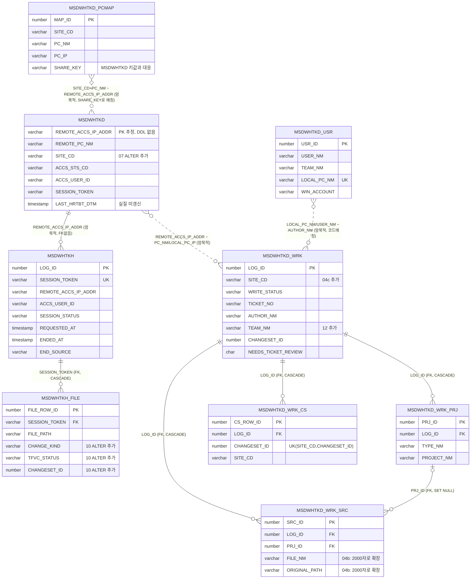

# GBCWorkHub — Database Schema Reference

> 대상 DB: Oracle, 스키마 `XSUP`. 앱 연결 정보는 `src/GBCWorkHub.UI/App.config`의 `connectionStrings/GbcWorkHubDb`.
> 본 문서는 실제 코드(`src/GBCWorkHub.DAC/*.cs`)와 DDL 스크립트(`sql/*.sql`)를 직접 대조 검증해 작성했다. 추측/생성된 컬럼은 없으며, DDL이 존재하지 않는 테이블은 명시적으로 "DDL 없음"으로 표기했다.
> 신뢰도 표기: **[확인됨]**(DDL로 직접 확인) / **[역추정]**(DDL 없이 코드 사용 패턴으로만 추정, 타입·제약 불명).

---

## 1. 테이블 전체 목록 및 사용 상태

| # | 테이블 | 상태 | DDL 근거 | 역할 |
|---|---|---|---|---|
| 1 | `XSUP.MSDWHTKD` | **핵심 사용, DDL 없음(레거시)** | 없음(ALTER만 존재: `sql/07`) | 원격 PC 점유 현재 상태 (1행 = PC 1대) |
| 2 | `XSUP.MSDWHTKH` | **핵심 사용** | `sql/03_MSDWHTKH_DDL.sql` | 원격 PC 접속/점유 이력 (세션 단위, 다건) |
| 3 | `XSUP.MSDWHTKD_WRK` | **핵심 사용** | `sql/04` + `04c`(SITE_CD 추가) + `12`(TEAM_NM 추가) | 업무기록 헤더 |
| 4 | `XSUP.MSDWHTKD_WRK_PRJ` | **핵심 사용** | `sql/04` | 업무기록의 Project 자식(N:1) |
| 5 | `XSUP.MSDWHTKD_WRK_SRC` | **핵심 사용** | `sql/04` + `04b`(컬럼 길이 확장) | 업무기록의 Source(파일) 자식(N:1) |
| 6 | `XSUP.MSDWHTKD_WRK_CS` | 사용 | `sql/04d` | 업무기록에 등록된 TFS Changeset 레지스트리 |
| 7 | `XSUP.MSDWHTKH_FILE` | 사용 | `sql/09` + `10`(TFVC 컬럼 확장) | 세션(접속) 종료 시 변경 파일/TFVC 분류 결과 |
| 8 | `XSUP.MSDWHTKD_USR` | 사용(신규) | `sql/14_MSDWHTKD_USR_PCMAP.sql` | 사용자(점유명·소속) 디렉터리, PC 1대=1행 |
| 9 | `XSUP.MSDWHTKD_PCMAP` | 사용(신규) | `sql/14_MSDWHTKD_USR_PCMAP.sql` | 사이트별 PC명↔IP↔점유키 별명 테이블 |
| — | `MSDWHTFS` / `GBC_REMOTE_PC` / `GBC_RDP_USAGE_LOG` | **폐기** | `sql/17_DROP_UNUSED.sql` | 초기·레거시 경로. 앱 미사용 |

시퀀스: `XSUP.SEQ_MSDWHTKH`, `SEQ_MSDWHTKD_WRK`, `SEQ_MSDWHTKD_WRK_PRJ`, `SEQ_MSDWHTKD_WRK_SRC`, `SEQ_MSDWHTKD_WRK_CS`, `SEQ_MSDWHTKH_FILE`, `SEQ_MSDWHTKD_USR`, `SEQ_MSDWHTKD_PCMAP`.

> **`README_DB_SETUP.md` 원문 확인**: "점유 마스터는 XSUP.MSDWHTKD. 접속 이력은 XSUP.MSDWHTKH. 업무기록은 MSDWHTKD_WRK*. 사용자 디렉터리는 MSDWHTKD_USR, 원격 PC 이름↔IP는 MSDWHTKD_PCMAP. **MSDWHTFS / MSDWHTWK / MSDWHTKD_LOG는 사용하지 않음.**"

---

## 2. 테이블별 전체 컬럼 스키마

### 2-1. `XSUP.MSDWHTKD` — 원격 PC 점유 상태 [역추정, DDL 없음]

DBA가 별도 관리하는 레거시 테이블로, 저장소에 `CREATE TABLE` 구문이 없다. 아래는 `sql/07_ALTER_MSDWHTKD_SITE_CD.sql`(ALTER문)과 `OracleRemotePcRepository.cs`의 SELECT/UPDATE 컬럼 목록에서 역추정한 것 — **타입 길이·NOT NULL·PK 제약은 확정할 수 없음**.

| 컬럼(추정) | 비고 |
|---|---|
| `REMOTE_ACCS_IP_ADDR` | 사실상 유일 식별자(PK로 추정). 사이트에 따라 실제 IP이거나 PC명 문자열(§4 참고) |
| `REMOTE_PC_NM` | 원격 PC명 |
| `SITE_CD` | `sql/07`에서 `ALTER TABLE ADD` — 원래 없던 컬럼 |
| `ACCS_STS_CD` | 상태코드: `AVAILABLE` / `CONNECTING` / `IN_USE` / `CHECK_REQUIRED` |
| `ACCS_IP_ADDR` | 현재 점유 중인 클라이언트(접속자) IP |
| `REMOTE_ACCS_DTM` | 최근 원격 접속 일시 |
| `ACCS_USER_ID` | 점유자 계정(점유명 또는 Windows 계정) |
| `ACCS_PC_NM` | 점유자 클라이언트 PC명 |
| `SESSION_TOKEN` | 점유 세션 토큰(GUID) |
| `ACCS_STRT_DTM` | 점유 시작 시각 |
| `LAST_HRTBT_DTM` | 마지막 하트비트(컬럼은 있으나 실제로는 갱신되지 않고 NULL 리셋에만 쓰임) |
| `UPDT_DTM` | 갱신 시각 |

`sql/07` ALTER의 백필 로직으로 사이트 판별 규칙을 알 수 있음:
```sql
-- AURORA: REMOTE_ACCS_IP_ADDR가 IPv4 형식(정규식 매칭)
-- RC: REMOTE_ACCS_IP_ADDR가 'HO-'로 시작하거나 PC명/IP값에 'BCARE' 포함
```

### 2-2. `XSUP.MSDWHTKH` — 접속 이력 [확인됨] (`sql/03_MSDWHTKH_DDL.sql`)

| 컬럼 | 타입 | 제약 |
|---|---|---|
| LOG_ID | NUMBER | **PK** |
| SESSION_TOKEN | VARCHAR2(50) | NOT NULL, **UNIQUE** |
| REMOTE_ACCS_IP_ADDR | VARCHAR2(50) | NOT NULL — *주석: MSDWHTKD.REMOTE_ACCS_IP_ADDR 참조(FK 제약은 없음)* |
| REMOTE_PC_NM | VARCHAR2(100) | |
| ACCS_USER_ID | VARCHAR2(200) | NOT NULL |
| ACCS_PC_NM | VARCHAR2(100) | |
| ACCS_IP_ADDR | VARCHAR2(50) | |
| SESSION_STATUS | VARCHAR2(30) | NOT NULL, CHECK IN ('CONNECTING','IN_USE','ENDED','CANCELLED','FAILED','CHECK_REQUIRED') |
| REQUESTED_AT | TIMESTAMP | NOT NULL |
| CONFIRMED_AT | TIMESTAMP | |
| ENDED_AT | TIMESTAMP | |
| END_SOURCE | VARCHAR2(50) | 예: MSTSC_EXIT, TAKEOVER, STALE_RECOVERY |
| RESULT_MESSAGE | VARCHAR2(1000) | |
| CREATED_AT | TIMESTAMP | DEFAULT SYSTIMESTAMP NOT NULL |
| UPDT_DTM | TIMESTAMP | DEFAULT SYSTIMESTAMP NOT NULL |

인덱스: `IX_MSDWHTKH_IP(REMOTE_ACCS_IP_ADDR)`, `IX_MSDWHTKH_REQ(REQUESTED_AT)`

### 2-3. `XSUP.MSDWHTKD_WRK` — 업무기록 헤더 [확인됨] (`sql/04` + `04c` + `12`)

| 컬럼 | 타입 | 제약 | 비고 |
|---|---|---|---|
| LOG_ID | NUMBER | NOT NULL, **PK** | |
| CLIENT_KEY | VARCHAR2(100) | | |
| SITE_CD | VARCHAR2(20) | | `04c`에서 ALTER ADD, 기존행 'AURORA' 백필 |
| WRITE_STATUS | VARCHAR2(20) | NOT NULL, CHECK IN ('DRAFT','COMPLETED') | |
| TICKET_NO | VARCHAR2(100) | | |
| TICKET_CONTENTS | VARCHAR2(2000) | | |
| MENU_NM | VARCHAR2(200) | | |
| PC_NM | VARCHAR2(100) | | |
| PERSON_IN_CHARGE | VARCHAR2(200) | | |
| LOCAL_PC_IP | VARCHAR2(50) | | |
| START_DT | TIMESTAMP | | |
| END_DT | TIMESTAMP | | |
| DEPLOY_STATUS | VARCHAR2(50) | | |
| DEPLOY_DT | TIMESTAMP | | |
| WORK_COMMENT | VARCHAR2(2000) | | |
| CHANGESET_ID | NUMBER | DEFAULT 0 | |
| TFS_COMMENT | VARCHAR2(2000) | | |
| TFS_AUTHOR | VARCHAR2(200) | | |
| AUTHOR_NM | VARCHAR2(200) | | 작성자(점유명) — 업무기록 소유권 판정 키 |
| TEAM_NM | VARCHAR2(100) | | `12`에서 ALTER ADD (런타임에 존재 여부 probe하는 하위호환 코드 있음) |
| CHECKED_IN_AT | TIMESTAMP | | |
| CHANGED_FILE_COUNT | NUMBER | DEFAULT 0 | |
| NEEDS_TICKET_REVIEW | CHAR(1) | DEFAULT 'Y' NOT NULL, CHECK IN ('Y','N') | |
| CREATED_AT | TIMESTAMP | DEFAULT SYSTIMESTAMP NOT NULL | |
| UPDT_DTM | TIMESTAMP | DEFAULT SYSTIMESTAMP NOT NULL | |

인덱스: WRITE_STATUS, SITE_CD, CHANGESET_ID, UPDT_DTM, LOCAL_PC_IP, TEAM_NM

### 2-4. `XSUP.MSDWHTKD_WRK_PRJ` — Project 자식 [확인됨] (`sql/04`)

| 컬럼 | 타입 | 제약 |
|---|---|---|
| PRJ_ID | NUMBER | NOT NULL, **PK** |
| LOG_ID | NUMBER | NOT NULL, **FK → MSDWHTKD_WRK.LOG_ID, ON DELETE CASCADE** |
| TYPE_NM | VARCHAR2(100) | |
| CATEGORY_NM | VARCHAR2(100) | |
| PROJECT_NM | VARCHAR2(200) | |
| SOURCE_ORIGIN | VARCHAR2(50) | |
| DEPLOY_STATUS | VARCHAR2(50) | |
| DEPLOY_DT | TIMESTAMP | |
| WORK_COMMENT | VARCHAR2(2000) | |
| SORT_ORD | NUMBER | DEFAULT 0 NOT NULL |
| CREATED_AT / UPDT_DTM | TIMESTAMP | DEFAULT SYSTIMESTAMP NOT NULL |

### 2-5. `XSUP.MSDWHTKD_WRK_SRC` — Source 자식 [확인됨] (`sql/04` + `04b`)

| 컬럼 | 타입 | 제약 |
|---|---|---|
| SRC_ID | NUMBER | NOT NULL, **PK** |
| LOG_ID | NUMBER | NOT NULL, **FK → MSDWHTKD_WRK.LOG_ID, ON DELETE CASCADE** |
| PRJ_ID | NUMBER | **FK → MSDWHTKD_WRK_PRJ.PRJ_ID, ON DELETE SET NULL** |
| FILE_NM | VARCHAR2(**2000**) | `04b`에서 길이 확장(원래 짧았음, 한글/긴 경로 ORA-12899 대응) |
| ORIGINAL_PATH | VARCHAR2(**2000**) | `04b`에서 길이 확장 |
| CHANGE_TYPE | VARCHAR2(50) | |
| CHANGE_DETAIL | VARCHAR2(1000) | |
| TYPE_NM | VARCHAR2(100) | |
| CATEGORY_NM | VARCHAR2(100) | |
| PROJECT_NM | VARCHAR2(200) | |
| SOURCE_ORIGIN | VARCHAR2(50) | |
| APPLIED_RULE_CD | VARCHAR2(100) | |
| IS_AUTO_CLASSIFIED | CHAR(1) | DEFAULT 'N' NOT NULL, CHECK IN ('Y','N') |
| NEEDS_REVIEW | CHAR(1) | DEFAULT 'N' NOT NULL, CHECK IN ('Y','N') |
| REVIEW_REASON | VARCHAR2(500) | |
| SORT_ORD | NUMBER | DEFAULT 0 NOT NULL |
| CREATED_AT / UPDT_DTM | TIMESTAMP | DEFAULT SYSTIMESTAMP NOT NULL |

### 2-6. `XSUP.MSDWHTKD_WRK_CS` — 등록 Changeset 레지스트리 [확인됨] (`sql/04d`)

| 컬럼 | 타입 | 제약 |
|---|---|---|
| CS_ROW_ID | NUMBER | NOT NULL, **PK** |
| LOG_ID | NUMBER | NOT NULL, **FK → MSDWHTKD_WRK.LOG_ID, ON DELETE CASCADE** |
| CHANGESET_ID | NUMBER | NOT NULL |
| SITE_CD | VARCHAR2(20) | |
| CHECKED_IN_AT | TIMESTAMP | |
| CREATED_AT | TIMESTAMP | DEFAULT SYSTIMESTAMP NOT NULL |

**제약**: `UNIQUE(SITE_CD, CHANGESET_ID)` — 같은 사이트에서 같은 Changeset이 두 번 등록되는 것을 방지.

### 2-7. `XSUP.MSDWHTKH_FILE` — 세션별 변경 파일 [확인됨] (`sql/09` + `10`)

| 컬럼 | 타입 | 제약 | 비고 |
|---|---|---|---|
| FILE_ROW_ID | NUMBER | NOT NULL, **PK** | |
| SESSION_TOKEN | VARCHAR2(50) | NOT NULL, **FK → MSDWHTKH.SESSION_TOKEN(UNIQUE컬럼), ON DELETE CASCADE** | PK가 아닌 UNIQUE 컬럼을 참조하는 FK |
| FILE_PATH | VARCHAR2(1000) | NOT NULL | |
| FIRST_CHANGE_DT | TIMESTAMP | 원래 NOT NULL → **`10`에서 NULL 허용으로 완화** | |
| LAST_CHANGE_DT | TIMESTAMP | 원래 NOT NULL → **`10`에서 NULL 허용으로 완화** | |
| CONTENT_CHANGED | CHAR(1) | NOT NULL, CHECK IN ('Y','N') | |
| START_HASH | VARCHAR2(64) | | |
| END_HASH | VARCHAR2(64) | | |
| CONFIDENCE | VARCHAR2(10) | CHECK IN ('HIGH','MEDIUM','LOW') OR NULL | |
| REASON | VARCHAR2(500) | | |
| CHANGE_KIND | VARCHAR2(30) | **`10`에서 ALTER ADD**, CHECK IN ('CheckedIn','PendingChanged','SessionMetadataChanged','Added','Deleted') OR NULL | |
| TFVC_STATUS | VARCHAR2(20) | **`10`에서 ALTER ADD**, CHECK IN ('CHECKED_IN','PENDING','NONE') OR NULL | |
| CHANGESET_ID | NUMBER | **`10`에서 ALTER ADD** | |
| DIFF_AVAILABLE | CHAR(1) | **`10`에서 ALTER ADD**, DEFAULT 'N', CHECK IN ('Y','N') | |
| DIFF_SUMMARY | VARCHAR2(1000) | **`10`에서 ALTER ADD** | |
| CREATED_AT / UPDT_DTM | TIMESTAMP | DEFAULT SYSTIMESTAMP NOT NULL | |

**제약**: `UNIQUE(SESSION_TOKEN, FILE_PATH)`. 인덱스: SESSION_TOKEN, CHANGE_KIND, CHANGESET_ID.

> `10` ALTER 주석: "FileSystemWatcher 기반 설계(FIRST/LAST_CHANGE_DT, START/END_HASH)는 polling daemon 없이는 못 쓰므로 폐기 — connect/disconnect 2-point snapshot + TFVC 대조로 대체. 컬럼은 남기고 NOT NULL만 해제(과거 실행 흔적 보존)."

### 2-8. `XSUP.MSDWHTKD_USR` — 사용자(점유명) 디렉터리 [확인됨, 신규] (`sql/14`)

| 컬럼 | 타입 | 제약 |
|---|---|---|
| USR_ID | NUMBER | NOT NULL, **PK**(시퀀스 채번) |
| USER_NM | VARCHAR2(200) | NOT NULL — 점유명 |
| TEAM_NM | VARCHAR2(100) | |
| LOCAL_PC_NM | VARCHAR2(100) | NOT NULL, **UNIQUE** — 실질 식별키(이 Windows PC 한 줄) |
| LOCAL_PC_IP | VARCHAR2(50) | |
| WIN_ACCOUNT | VARCHAR2(200) | |
| CREATED_AT / UPDT_DTM | TIMESTAMP | DEFAULT SYSTIMESTAMP NOT NULL |

FK 없음(독립 테이블). 인덱스: USER_NM, TEAM_NM. 애플리케이션은 `MERGE ... ON (LOCAL_PC_NM)`으로 upsert하므로 **PC 1대 = 행 1개**가 보장된다(로그인 계정이 아니라 PC 단위 디렉터리).

### 2-9. `XSUP.MSDWHTKD_PCMAP` — 사이트별 PC명↔IP 별명 [확인됨, 신규] (`sql/14`)

| 컬럼 | 타입 | 제약 |
|---|---|---|
| MAP_ID | NUMBER | NOT NULL, **PK**(시퀀스 채번) |
| SITE_CD | VARCHAR2(20) | NOT NULL |
| PC_NM | VARCHAR2(100) | NOT NULL |
| PC_IP | VARCHAR2(50) | |
| SHARE_KEY | VARCHAR2(100) | `MSDWHTKD.REMOTE_ACCS_IP_ADDR`에 실제로 들어가는 값과 대응 |
| UPDT_DTM | TIMESTAMP | DEFAULT SYSTIMESTAMP NOT NULL |

**제약**: `UNIQUE(SITE_CD, PC_NM)`. FK 없음(독립 테이블). 인덱스: (SITE_CD, PC_IP), SHARE_KEY.

**중요**: 시드 데이터로 사이트별 SHARE_KEY 규칙이 드러남 —
- AURORA: `SHARE_KEY = PC_IP`(실제 IPv4, 예 `172.16.49.59`)
- CMC/RC: `SHARE_KEY = PC_NM`(PC명 문자열 그대로, 예 `P-BCTECH1`, `HO-01-HIS-11`) — **즉 `MSDWHTKD.REMOTE_ACCS_IP_ADDR` 컬럼명은 "IP"지만 CMC/RC에서는 실제로 PC명 문자열이 들어간다.**

### 2-10. 폐기 테이블

`MSDWHTFS`, `GBC_REMOTE_PC`, `GBC_RDP_USAGE_LOG`, `MSDWHTWK` — 앱 미사용. DBA는 `sql/17_DROP_UNUSED.sql`.

---

## 3. 참조관계(FK) — 실제 DB 제약 전체 목록

| 자식 테이블.컬럼 | → 부모 테이블.컬럼 | ON DELETE |
|---|---|---|
| `MSDWHTKD_WRK_PRJ.LOG_ID` | → `MSDWHTKD_WRK.LOG_ID` | CASCADE |
| `MSDWHTKD_WRK_SRC.LOG_ID` | → `MSDWHTKD_WRK.LOG_ID` | CASCADE |
| `MSDWHTKD_WRK_SRC.PRJ_ID` | → `MSDWHTKD_WRK_PRJ.PRJ_ID` | **SET NULL** |
| `MSDWHTKD_WRK_CS.LOG_ID` | → `MSDWHTKD_WRK.LOG_ID` | CASCADE |
| `MSDWHTKH_FILE.SESSION_TOKEN` | → `MSDWHTKH.SESSION_TOKEN`(UNIQUE 컬럼, PK 아님) | CASCADE |

**이 5개가 DB에 실제로 존재하는 FK 전부다.** `MSDWHTKD_USR`, `MSDWHTKD_PCMAP`, `MSDWHTKD`는 FK로 묶이지 않는다.

---

---

## 4. 식별관계(Identifying Relationship) — FK 없이 코드가 매칭하는 관계

DB 제약(FK)이 없고, 애플리케이션 코드(WHERE절 문자열 비교)로만 연결되는 논리적 관계들이다. 발표/분석 시 "정규화된 관계형 스키마"가 아니라 "레거시 테이블(MSDWHTKD)을 건드릴 수 없어서 코드 레벨 조인으로 우회한 구조"임을 이해하는 것이 중요하다.

| 관계 | 매칭 컬럼 | 근거 |
|---|---|---|
| `MSDWHTKH.REMOTE_ACCS_IP_ADDR` ↔ `MSDWHTKD.REMOTE_ACCS_IP_ADDR` | 문자열 완전일치 | DDL 주석에 "참조"라고만 적혀있고 FK 없음(MSDWHTKD가 변경불가 레거시라 FK 추가 불가) |
| `MSDWHTKD_WRK.PC_NM` / `LOCAL_PC_IP` ↔ `MSDWHTKD.REMOTE_ACCS_IP_ADDR` | `w.PC_NM = :pcNm OR w.LOCAL_PC_IP = :pcNm` | `OracleWorkLogRepository`의 PC 필터 쿼리 |
| `MSDWHTKD_WRK.CHANGESET_ID`(단일값) ↔ `MSDWHTKD_WRK_CS.CHANGESET_ID`(레지스트리) | 애플리케이션이 저장 시마다 동기화 | DB 제약 없음, 저장 로직이 `DeleteChangesetChildren`+`InsertChangesets`로 매번 재작성 |
| `MSDWHTKD_USR.LOCAL_PC_NM` ↔ (모든 테이블의 사용자/PC 관련 컬럼) | 문자열 매칭(대소문자 무시) | `DirectoryBiz.LookupTeam(userName, localPcName)` — PC명 우선, 없으면 USER_NM/WIN_ACCOUNT로 매칭 |
| `MSDWHTKD_PCMAP.(SITE_CD, PC_NM)` ↔ `MSDWHTKD.REMOTE_ACCS_IP_ADDR`(사이트별 값) | `PCMAP.SHARE_KEY` = `MSDWHTKD`의 실제 키값 | AURORA는 SHARE_KEY=IP, CMC/RC는 SHARE_KEY=PC명 — §2-9 참고 |
| `MSDWHTKD_WRK.AUTHOR_NM` (업무기록 소유권) | 완전일치, 없으면 `LOCAL_PC_IP`로 폴백 | `WHERE UPPER(TRIM(w.AUTHOR_NM))=UPPER(:authorNm) OR (w.AUTHOR_NM IS NULL AND UPPER(TRIM(w.LOCAL_PC_IP))=UPPER(:authorLocalIp))` |
| `MSDWHTKH.ACCS_USER_ID` (접속 이력 "내 이력" 조회) | 점유명/Windows계정/SAM계정/클라이언트PC명 중 하나라도 일치(OR) | `GetRecentUsageLogsForOccupantCore`의 4중 OR 조건 |

---

## 5. ERD (Mermaid)



---

## 6. 정규화되지 않은 지점 / 알아둘 사항

1. **`MSDWHTKD`는 CREATE TABLE 원본이 저장소에 없다.** DBA가 별도로 만든 레거시 테이블이며 "테이블 구조는 변경하지 않는다"는 원칙 하에 운영된다(`README_DB_SETUP.md`). 컬럼 존재는 `07` ALTER문과 애플리케이션 SELECT절로만 확인 가능하다.
2. **`MSDWHTKD.REMOTE_ACCS_IP_ADDR` 컬럼은 이름과 달리 항상 IP가 아니다.** AURORA는 실제 IP, CMC/RC는 PC명 문자열이 들어간다(`MSDWHTKD_PCMAP.SHARE_KEY` 값이 그 증거).
3. **`MSDWHTFS` / `GBC_*` / `MSDWHTWK`는 폐기.** 업무기록은 `MSDWHTKD_WRK*`. DROP은 `sql/17`.
4. **FK가 있는 곳은 `MSDWHTKD_WRK` 계열(자식 3종)과 `MSDWHTKH_FILE→MSDWHTKH` 뿐이다.** 나머지 모든 "관계"는 문자열 비교 기반 식별관계이며, 이는 레거시 `MSDWHTKD` 테이블을 건드릴 수 없어 신규 테이블(`MSDWHTKD_USR`, `MSDWHTKD_PCMAP`)조차 FK로 묶지 못하고 별도 사전(directory) 테이블로 둔 것으로 보인다.
5. **소프트 삭제 컬럼은 어느 테이블에도 없다.** 삭제는 전부 물리적 `DELETE FROM`이며, `MSDWHTKD_WRK_PRJ`/`_SRC`/`_CS`는 FK의 `ON DELETE CASCADE`로도 정리되지만 애플리케이션 코드가 명시적으로 자식부터 순차 DELETE한다.
